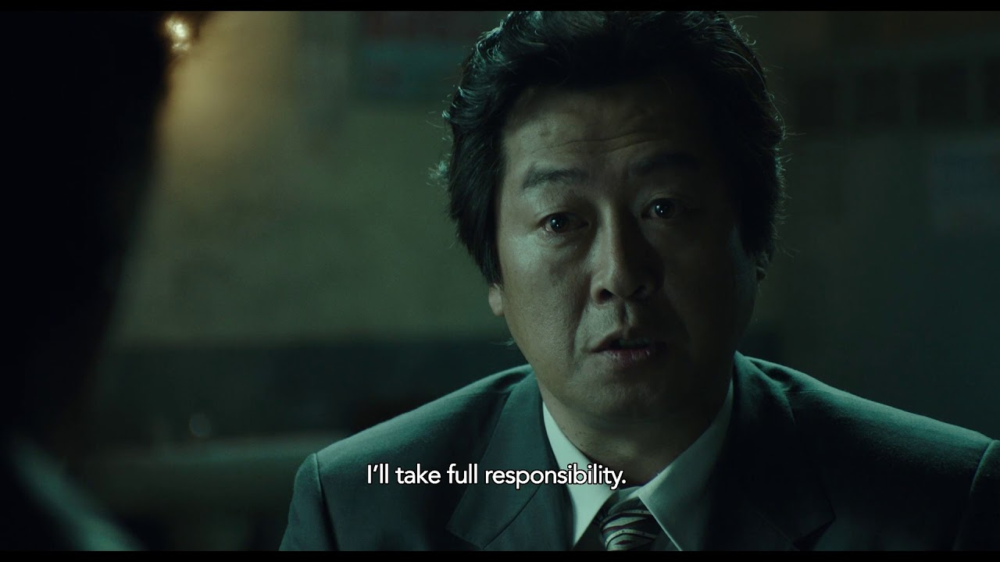
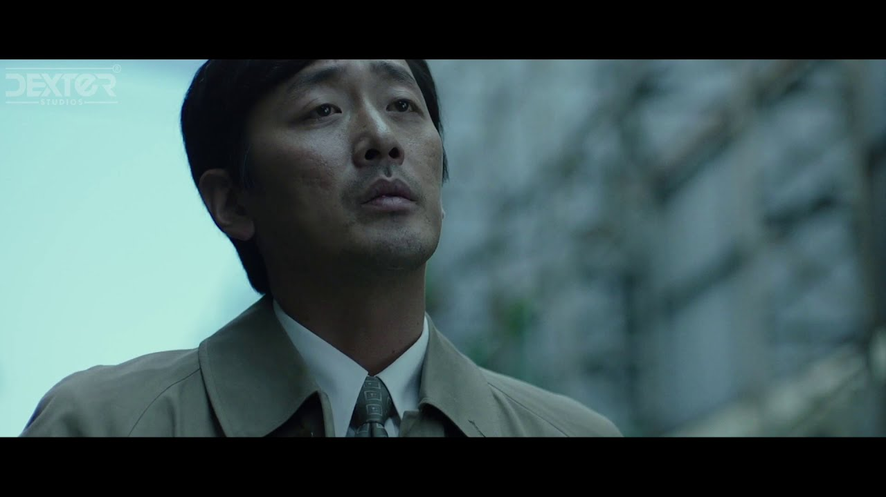

<1987: When the Day Comes> is a South Korean film directed by Jun-Hwan Jang and based on a true event. I participated in the post-production as a VFX compositor led by VFX supervisor Jeong-Hon Hong.

Synopsis In 1987 Korea, under an oppressive military regime, a college student gets killed during a police interrogation involving torture. Government officials are quick to cover up the death and order the body to be cremated. A prosecutor who is supposed to sign the cremation release, raises questions about a 21-year-old kid dying of a heart attack, and begins looking into the case for the truth.

Trailer

VFX Showreel

> Dexter Studios: Web > Watch the film: Netflix, YouTube

