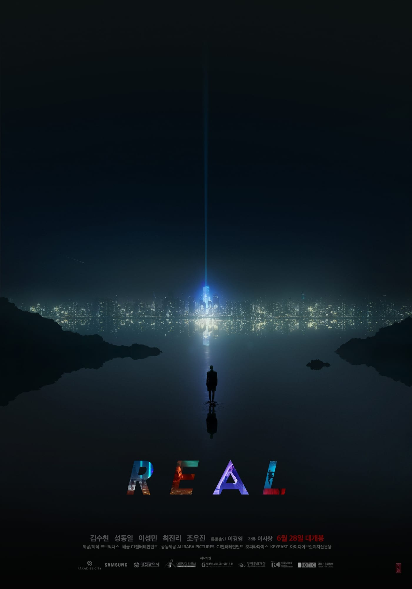

*My VFX compositing showreel · Dexter Studios, 2016–2018*

*1987: When the Day Comes*, directed by Jun-Hwan Jang, is based on a true event. I joined the
post-production as a **VFX compositor** on the team led by VFX supervisor Jeong-Hon Hong at
**Dexter Studios**.

## Synopsis

In 1987 Korea, under an oppressive military regime, a college student is killed during a police
interrogation involving torture. Officials rush to cover up the death and order the body cremated. The
prosecutor meant to sign the cremation release questions how a 21-year-old could die of a heart attack
— and begins pulling at the truth.

