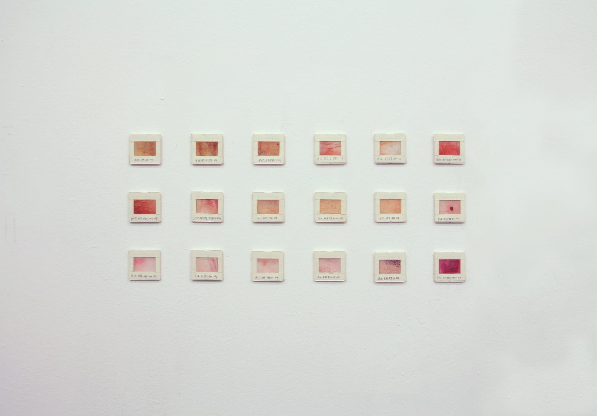
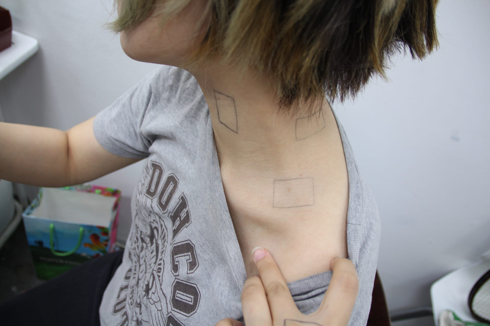
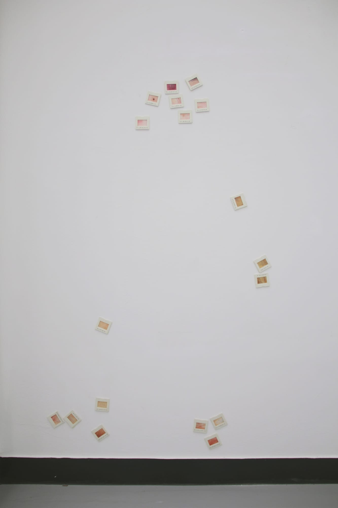
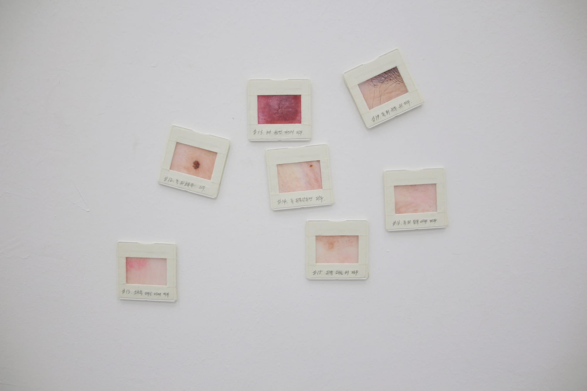
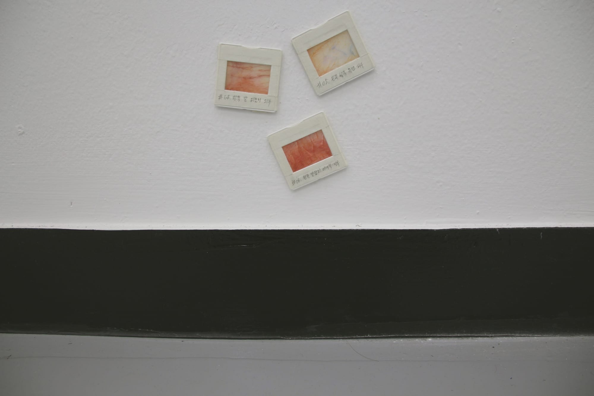
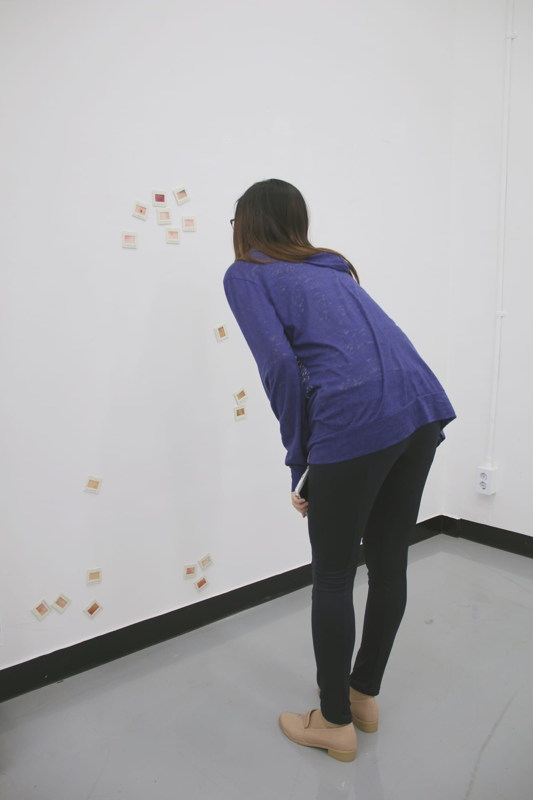
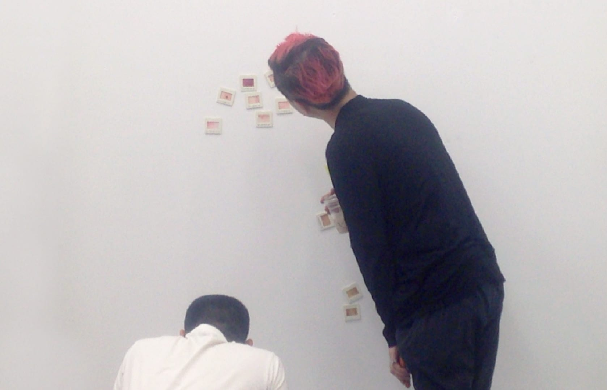

*Watercolor on translucent paper · 2014*

When I look at myself through my own eyes, or caress someone else's body, I see the subject far closer
than a mirror or a camera allows — as if examining a skin specimen under a microscope. Looking at a
section sliced from a whole, we cannot help but imagine the whole. As viewers follow the numbered parts
of a body, they piece the entire figure back together. By observing and drawing the subject this
closely, over and over, I tried to render a *tactile gaze*.

## Tracing the body

Each painting is a fragment of the body, yet through numbering and arrangement the whole can still be
imagined. I place a film mount against the subject's body and trace its frame with a pen, then draw
that part at the same scale.

To give the sensation of transferring the very skin I was watching, I worked on translucent tracing
paper and painted in thin, lightly layered watercolor.

## Composing the fragments

