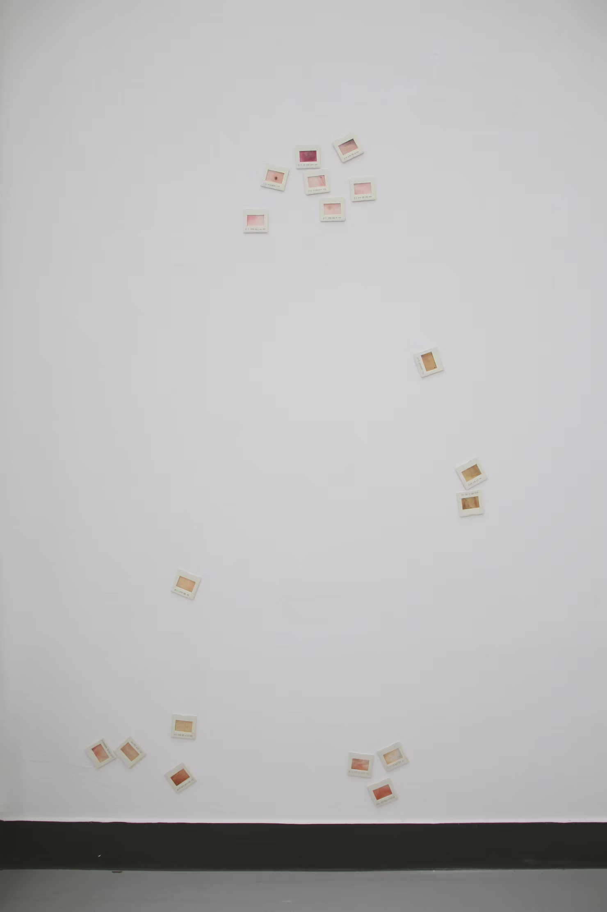

A Touching Gaze watercolor painting on translucent paper, 2014

When I look at myself through my own eyes and caress someone else's body, I see the subject much closer than through a mirror or camera. It feels as if I'm examining a skin specimen under a microscope. When we look at sliced sections of specimens within a whole, we cannot help but think about the entirety. As viewers follow the sequentially numbered parts of the human body, they catch glimpses of the entire body. By repeatedly observing and drawing the subject up close, I aimed to express a tactile gaze.

the subject's body and tracing it with a pen. To create the sensation of transferring the skin I am observing, I used translucent tracing paper and painted with a thin layer of watercolors.

Previous arrangement

