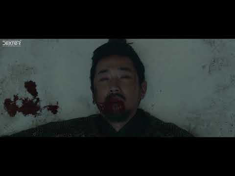

<Along with The Gods: The Last 49 Days> is a South Korean fantasy action film directed by Yong-Hwa Kim and based on a webtoon <Along with The Gods> by Ho-Min Joo. This film is the sequel to the 2017 film <Along with the Gods: The Two Worlds>. I participated in the post-production as a VFX compositor led by VFX supervisor Jong- Hyun Jin.

Synopsis While defending an unlikely soul, the afterlife Guardians investigate an elderly man who’s outstayed his time on Earth, and delve into their own past.

Trailer

VFX Showreel

> Dexter Studios: Web > Watch the film: Netflix, YouTube

