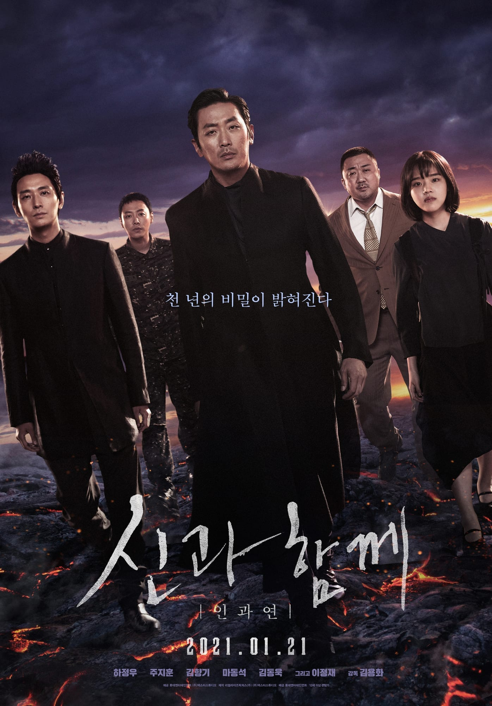

*My VFX compositing showreel · Dexter Studios, 2016-2018*

*Along with the Gods: The Last 49 Days*, directed by Yong-Hwa Kim, is the sequel to *The Two Worlds*,
based on Ho-Min Joo's webtoon *Along with the Gods*. I joined the post-production as a **VFX
compositor** on the team led by VFX supervisor Jong-Hyun Jin at **Dexter Studios**.

## Synopsis

While defending an unlikely soul, the afterlife Guardians look into an elderly man who has outstayed
his time on Earth, and into their own pasts.

