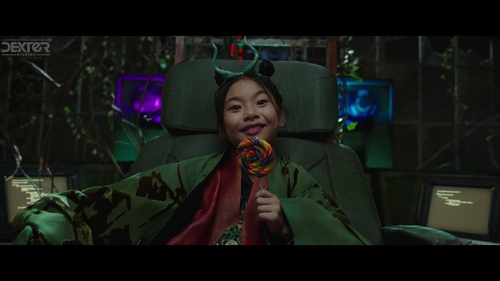

<Along with The Gods: The Two Worlds> is a South Korean fantasy action film directed by Yong-Hwa Kim and based on a webtoon <Along with The Gods> by Ho-Min Joo. I participated in the post-production as a VFX compositor led by VFX supervisor Jong-Hyun Jin.

Synopsis A firefighter dies and arrives in the afterlife, where Guardians take him through the seven trials and a perilous journey through different hells.

Trailer

VFX Showreel

> Dexter Studios: Web > Watch the film: Netflix, YouTube

