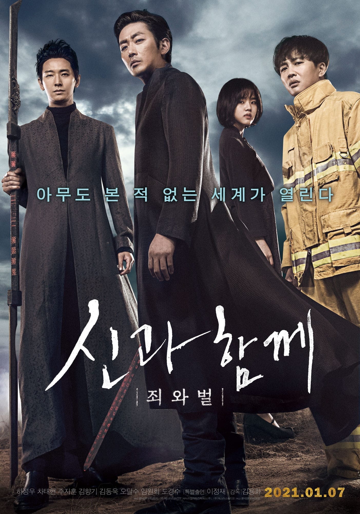

*My VFX compositing showreel · Dexter Studios, 2016-2018*

*Along with the Gods: The Two Worlds*, directed by Yong-Hwa Kim, is based on Ho-Min Joo's webtoon
*Along with the Gods*. I joined the post-production as a **VFX compositor** on the team led by VFX
supervisor Jong-Hyun Jin at **Dexter Studios**.

## Synopsis

A firefighter dies and arrives in the afterlife, where Guardians lead him through seven trials and a
perilous journey across different hells.

