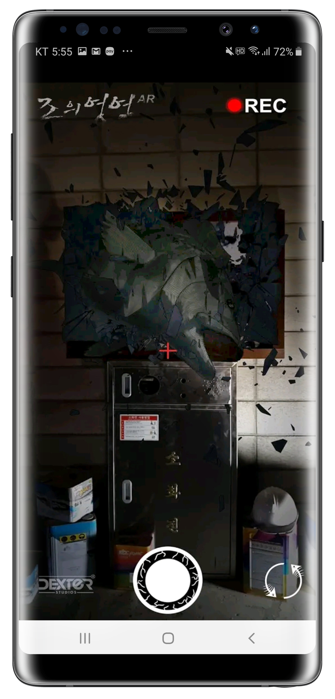
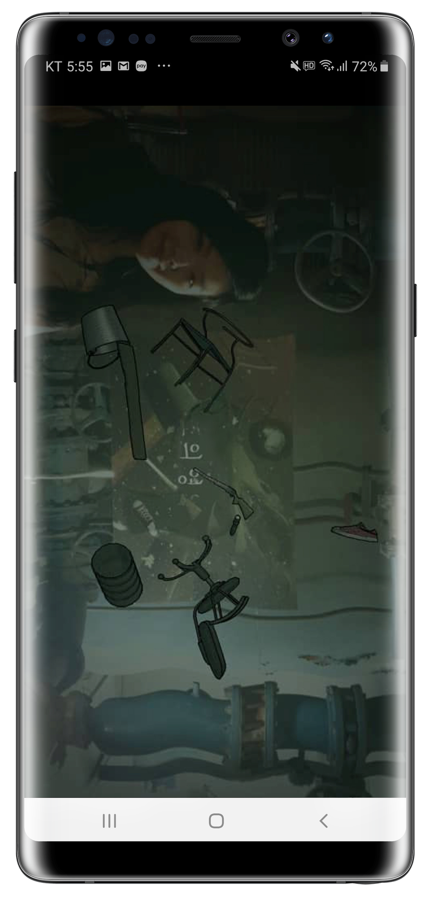
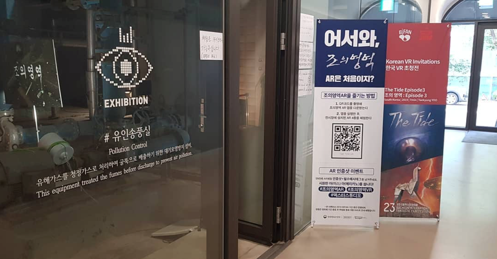
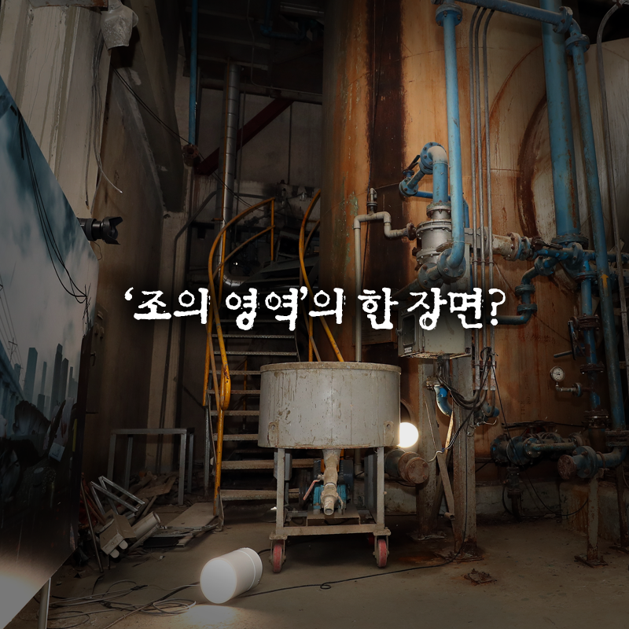
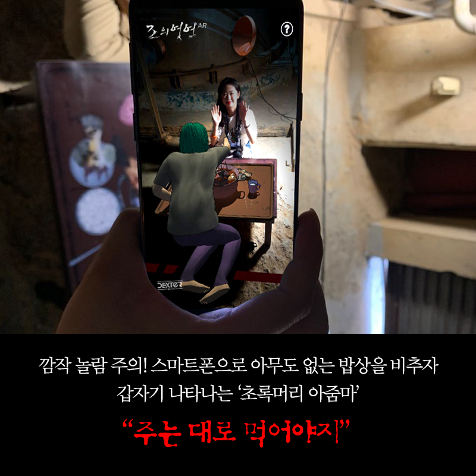
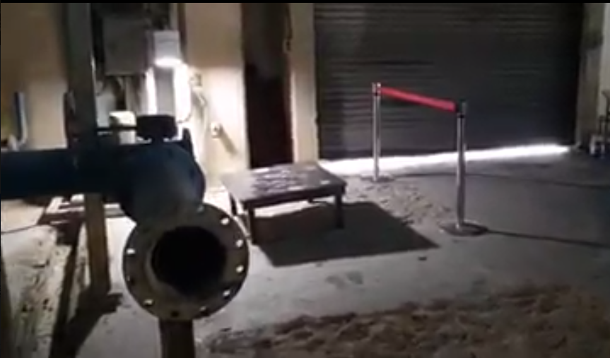

AR The Tide is an AR exhibition I helped build for the Bucheon International Fantastic Film Festival,
promoting Dexter Studios' VR horror film *VR The Tide*. I worked as a technical artist, handling 3D
model optimization, particle and screen effects, and the UI.

## How it works

In the pollution control room (B39) of the Bucheon Art Bunker, visitors download an Android AR app
and point the camera at objects such as a table or a window. The characters and giant fish from
the film then appear, animated.

## Process

We first optimized the digital assets — originally built for VR devices — to run on mobile,
applying lighter shaders and an outline effect, with extra visual effects (e.g., a shimmering
effect) where needed.

