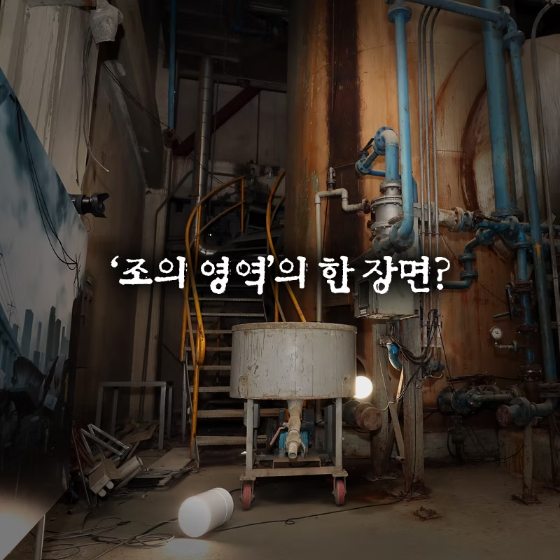
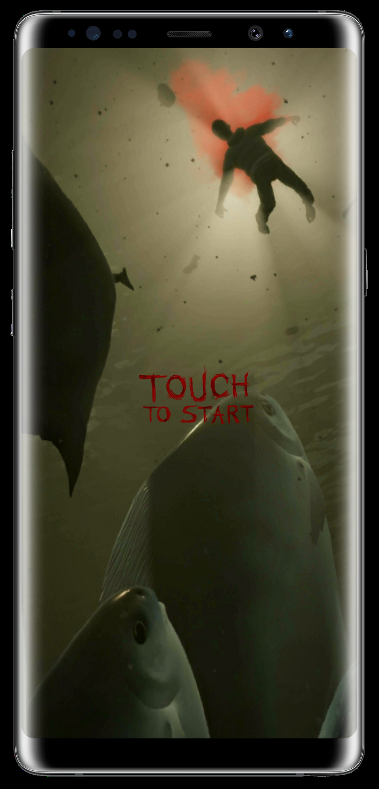
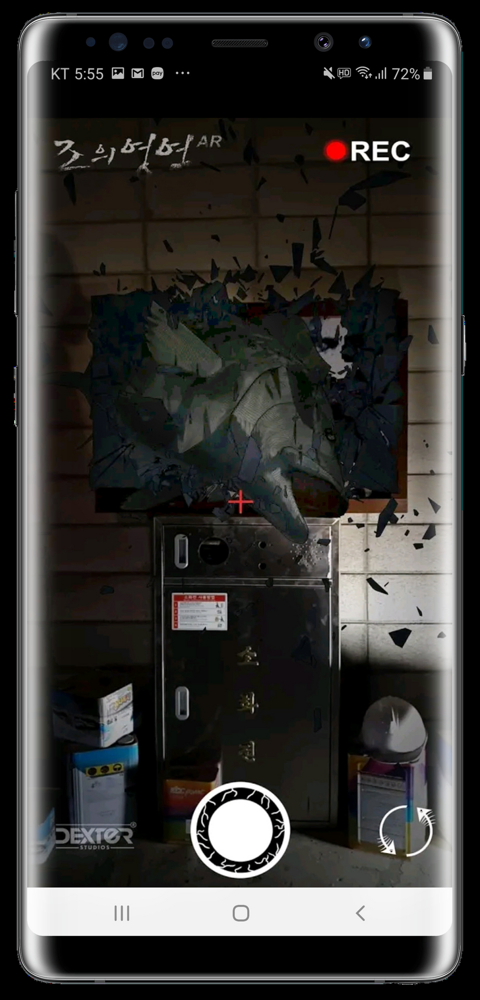
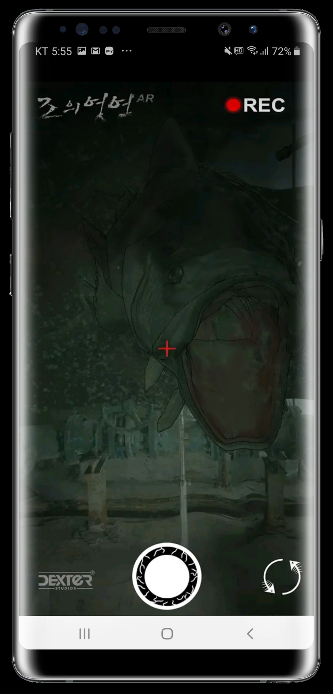
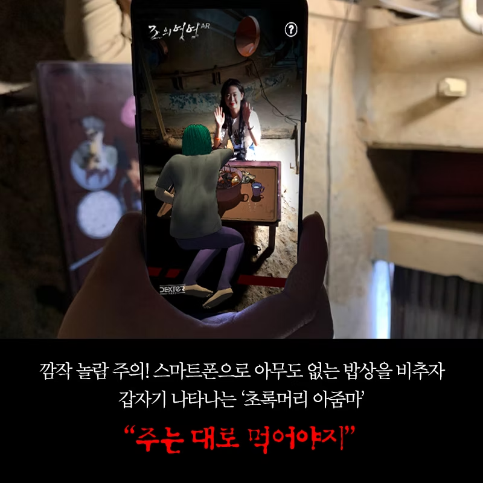
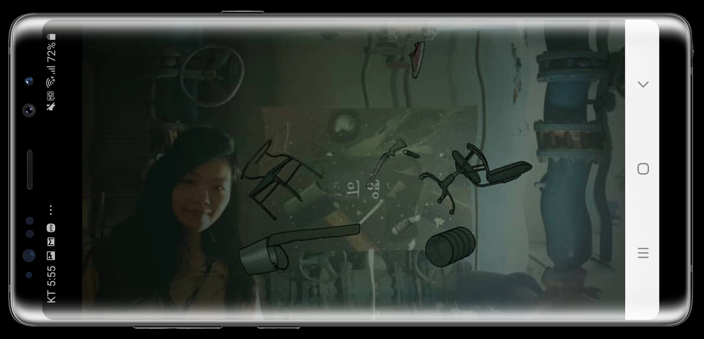
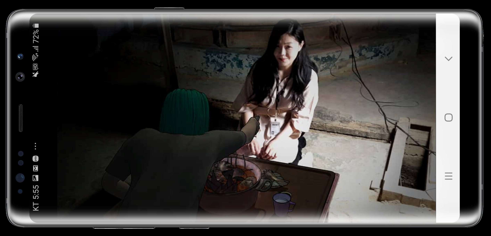

<AR The Tide> is an AR exhibition project created for the Bucheon International Fantastic Film Festival. The exhibition was designed to promote the VR horror Film <VR The Tide>(please check the link for further information on the film). I participated in project planning and content as a general artist and was in charge of 3D modeling optimization, particles, screen effects, and UI.

In the pollution control room(B39) of Bucheon Art Bunker, users download android AR application, point the camera at the objects(e.g., table, window). Then, the characters and giant fish from the film appear with animation.

Process

First, we optimized the digital assets made specifically for VR devices to utilize them on mobile devices. Then, we applied lighter shader and outline effect. When necessary, we applied additional visual effects (e.g., shimmering effect).

Record Swap Share

> Release: APK > Media Coverage: GameFocus > Related Work: VR The Tide

