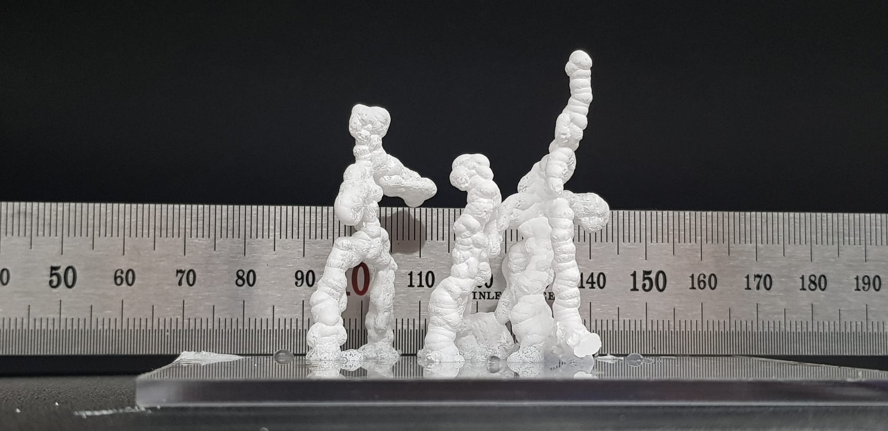
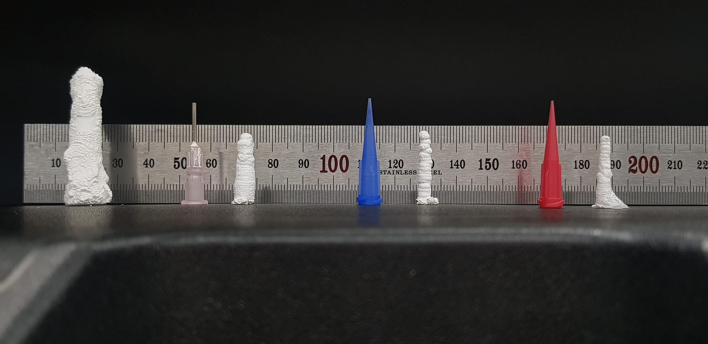

*Hot ice sculpture · 2021*

*ASAPeople* is an exploration of "hot ice" — sodium acetate.

## The material

Sodium acetate trihydrate (SAT, CH₃COONa·3H₂O), the same compound found in reusable hand warmers, is a
phase-change material that moves between a liquid solution and a solid crystal. Pour the liquid onto a
tiny seed of solid SAT and it instantly grows into an ice-like sculpture while releasing heat — the
phenomenon known as "hot ice."

## Food for thought

A sodium-acetate printer ("ASAPrinter") is a tempting next step: a fast way to build ice sculptures,
and a forgiving one — if I don't like a result, I can melt it in the microwave and reuse the same
solution for the next attempt. Building on top of existing sculptures, or joining two with fresh
liquid, could be just as interesting. The real challenge is control: getting the solubility right and
keeping the syringe from clogging.

*Thickness test — 25 mm height, different nozzle sizes.*
