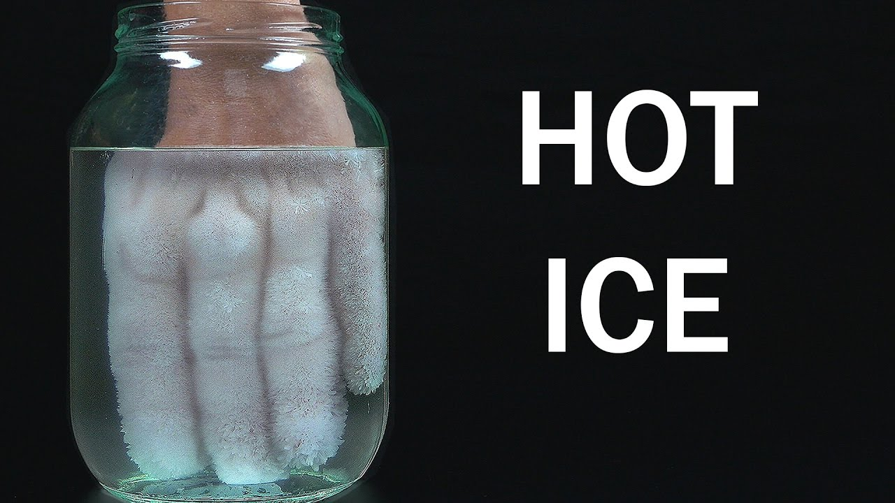
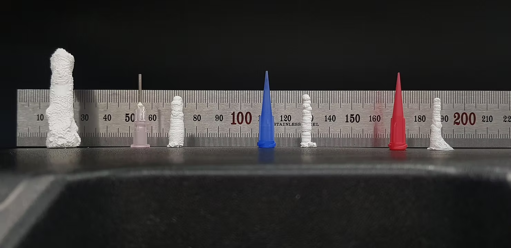

ASAPeople is an exploration of the material called "hot ice(Sodium Acetate)."

ASAPeople hot ice sculpture, 2021

Material Sodium Acetate Trihydrate (SAT), CH3COONa·3H2O, used in hot packs, is a phase change material (PCM) that transitions between a liquid SA aqueous solution and solid SAT. When liquid SA is poured onto a tiny amount of solid SAT, it instantly forms an ice sculpture while releasing heat. This phenomenon is commonly known as "hot ice." (Please see the fascinating video below)

Food for Thought

' Creating a Sodium Acetate Printer (ASAPrinter) sounds intriguing. It could be a neat way to build ice sculptures quickly. Plus, if I'm not satisfied with the result, I can easily melt it in the microwave and reuse the liquid SA solution to craft another ice sculpture with SAT. It might also be fun to try building on top of existing sculptures or connecting two sculptures using the liquid SA solution. However, I should be aware of potential downsides, such as ensuring the right solubility and avoiding syringe clogs for accurate results...'

Thickness Test (Height: 25mm, different size nozzles)

