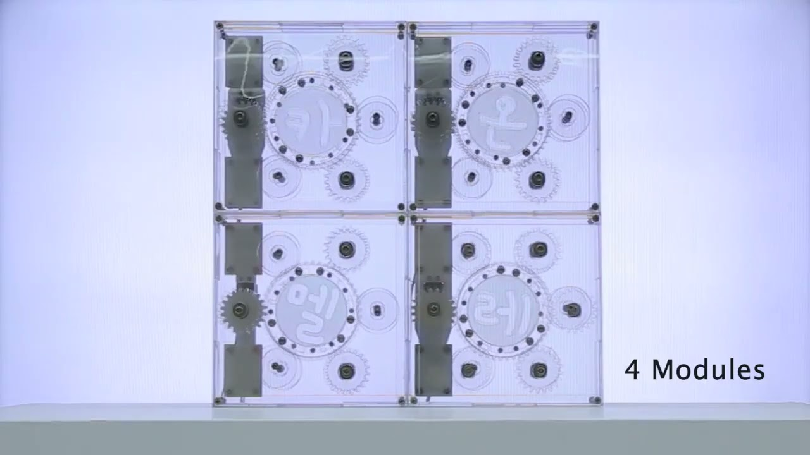

2020 material exploration of the polarizing film. Chameleon was made in a class
(KAIST ID506 Media Interaction Design) led by Prof. Woohun Lee.

The polarizing film is used by many makers because of its magical effect of turning views black
with transparent films. While previous works have succeeded in creating unexpected visual impact,
their focus on dual layers of the polarizing film raises questions about its incomplete exploration
of the material. Some use additional layers between polarizing films, such as OPP (oriented
polypropylene) film, creating a color-changing effect — but these works are static and function as
just decorative elements.

I present Chameleon, a transparent shape-changing physical interface achieving a color-changing
effect using polarization and refraction of polarizing film and OPP film. I explored the films in
their restriction of color representation and different shapes as the basis for a controllable
interface, proposing a layered gear mechanism as a module that can be replicated into various
graphics.
