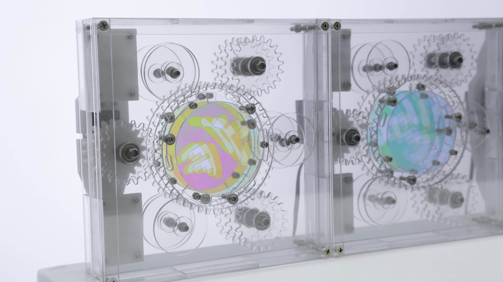
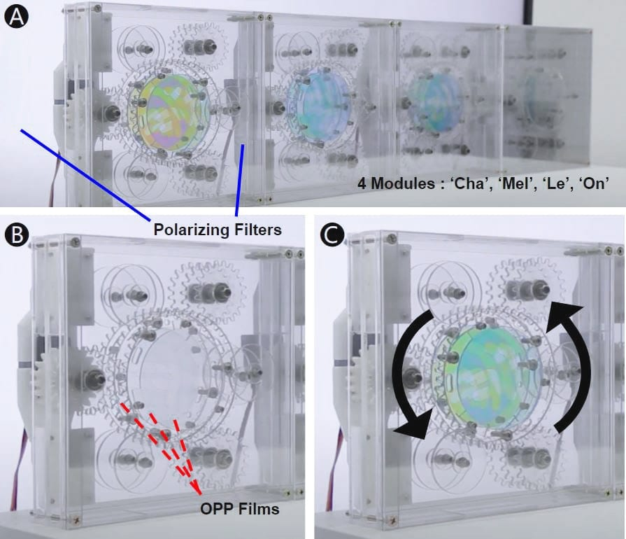

*Polarizing and OPP films on acrylic gears, rotated by a servo motor · 2020*

*Chameleon* came out of a material exploration in **KAIST ID506 Media Interaction Design**
(Prof. Woohun Lee), built around polarizing film.

Polarizing film is popular with makers for its almost magical trick: transparent sheets that turn a
view black as they rotate. Earlier works drew striking visual impact from it, but mostly stopped at
two stacked layers; adding an in-between layer such as OPP (oriented polypropylene) film produces a
color-changing effect, yet those pieces tend to stay static and decorative.

*Chameleon* pushes the material further: a transparent, shape-changing interface that produces color
through the polarization and refraction of polarizing and OPP film. Treating the films' limited color
range and varied shapes as the basis for control, I built a layered gear mechanism, a module that can
be repeated and recombined into many different graphics.

