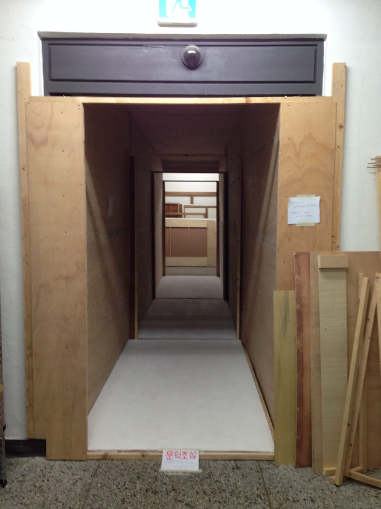
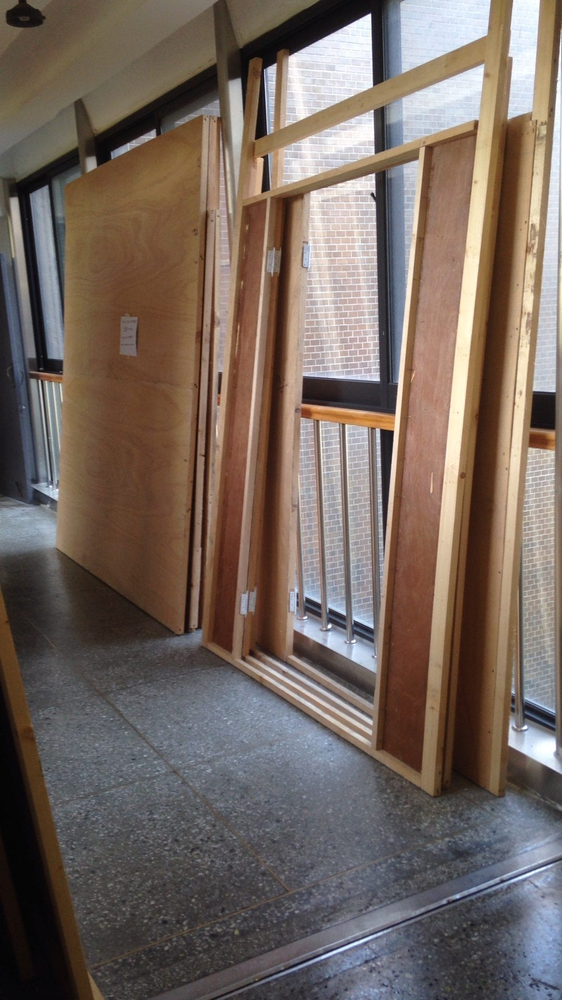
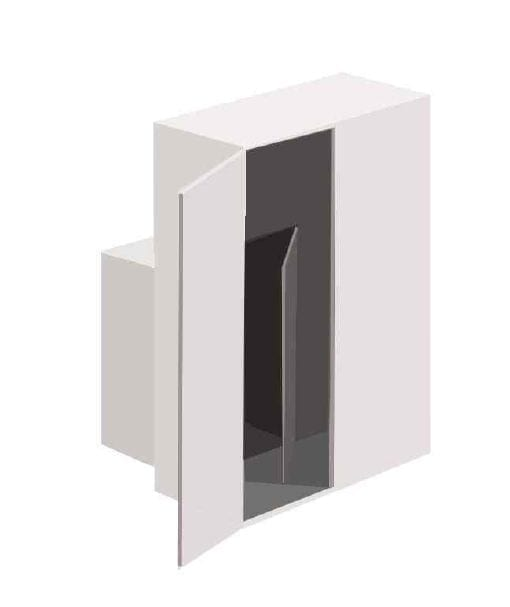
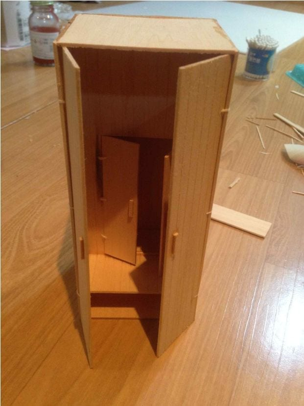
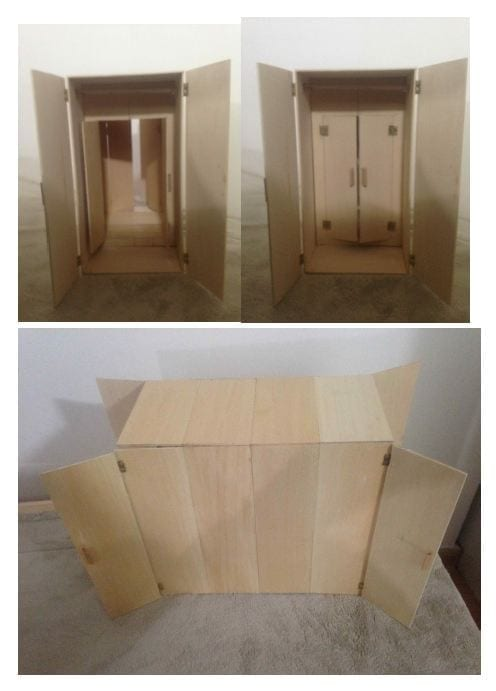

*3-channel video projection across three connected rooms · 2014*

Queer people are marginalized in a society organized around cisgender, heterosexual norms — but
discrimination also runs *inside* the queer community, minority against minority. I find that telling:
that people who know what exclusion feels like can still pass it on. To me, discrimination usually
starts with a preconception, and one of the most everyday preconceptions is how a person is expected
to dress. As a bisexual, I have often felt different communities quietly expecting a particular look
from me — and reading anyone who doesn't match it as an outsider.

## Three rooms, three closets

*Closet Inside the Closet* is a 2.2 × 2.5 m structure divided into three spaces — one read as
heterosexual, one as homosexual, one as bisexual. The rooms are separated by doors, yet each opens in
both directions, so you can walk straight through from one identity into another: every closet is
connected to the rest.

## One body, every look

The 3-channel video shows me wearing what each community treats as the "right" outfit — a skirt, long
hair and makeup in the heterosexual room; a leather jacket, trousers and short hair in the homosexual
room; a blended look in the bisexual room. In reality my own wardrobe isn't sorted that cleanly; I mix
all of it. Standing in a single white jumpsuit, I can be all three at once — which is the point:
identity isn't fixed, it's fluid.

