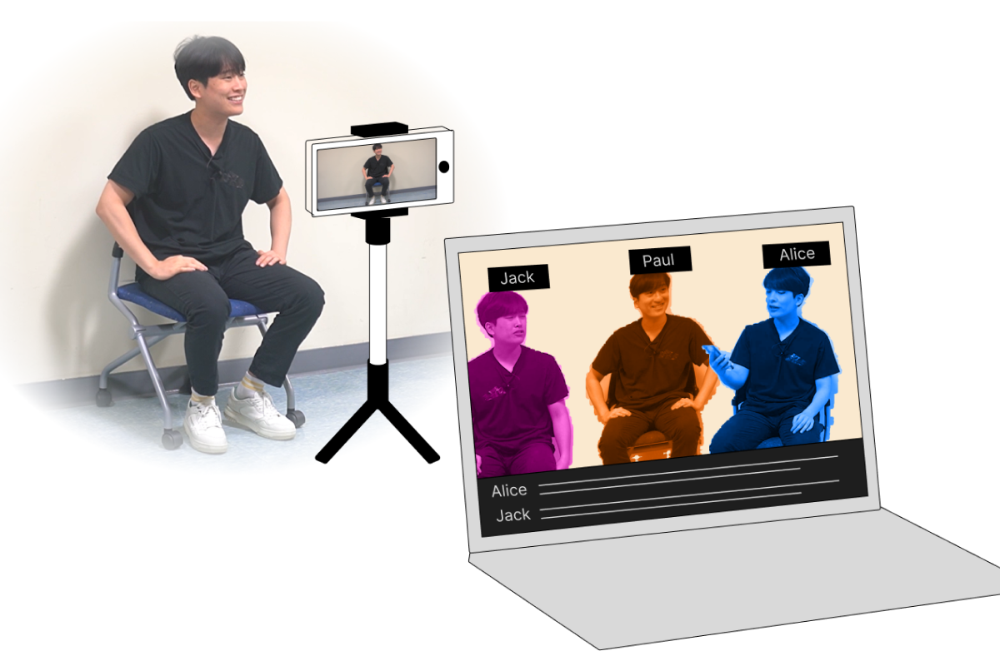

## Problem — previs is out of reach for indie filmmakers

Before shooting, directors work with storyboard artists or animators to visualize their ideas — a
step called *previsualization* (previs) that is crucial for creative decisions and collaboration. But
traditional previs (2D storyboards, 3D animation) takes substantial time, money, and technical skill.
Big-budget teams can absorb that; indie filmmakers usually can't.

## Solution — previs from video collages

CollageVis lets filmmakers build previs by collecting short video clips and compositing them into a
video collage. Video recording is already a familiar tool for filmmakers, and the resulting collage
is easy for technical and non-technical collaborators alike to read. The image below is a previs we
made replicating a scene from *Squid Game*.

## Two interfaces

The system runs mainly on a laptop, with a phone as a supplementary camera tool.

**① Collage Board — source collection & modification.** It takes videos (a test shot of a real actor,
or a crew member standing in) and composites them on a board in real time, with an image as the
backdrop. Name tags, color filters, and face-swap filters distinguish each character.

**② Virtual Stage — layout & camera exploration.** For more complex shots, it simulates a detailed
3D shooting environment (weather, location) where the user lays out actors, crew, lighting, and
multiple cameras. The companion mobile app drives a virtual camera, so camerawork can be explored
without 3D-software expertise. The system then outputs a previs video plus a floor-plan video tracing
each element's movement.

We grounded these features in formative interviews with indie filmmakers, replicated seven film
scenes to demonstrate the system, and evaluated it with six indie filmmakers — who found it a more
flexible yet expressive way to develop and communicate ideas.

