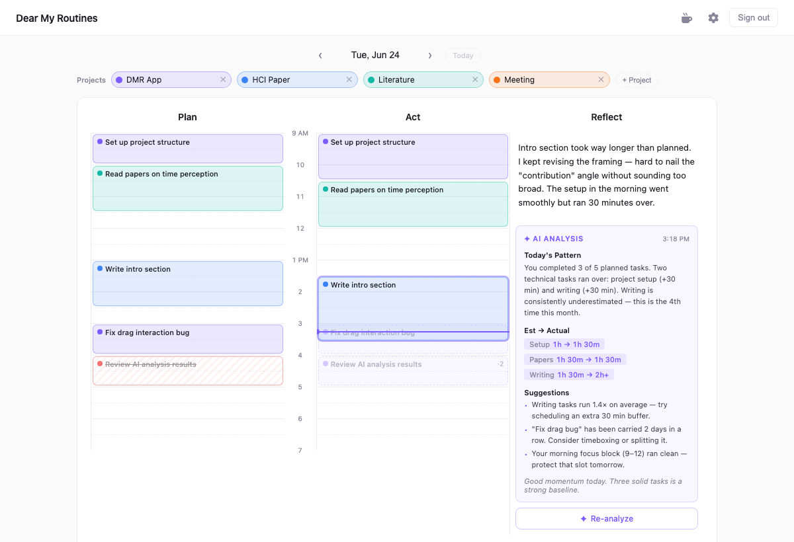

I've noticed that I often underestimate how long each task will actually take. So I built Dear My Routines — a personal time-management tool that helps you compare your planned time with your actual time.

It's meant for people who want to understand their own time patterns better, especially if you often think "this will only take 30 minutes" and then somehow it takes two hours.

## Plan → Act → Reflect

The interface is split into three columns:

- **Plan** — block out your day in advance
- **Act** — log what you actually did and when
- **Reflect** — see where your estimates diverged from reality, with AI-generated insights

The goal isn't to be more productive in the conventional sense — it's to build an honest picture of how you actually spend your time, so your future plans can be grounded in reality.
