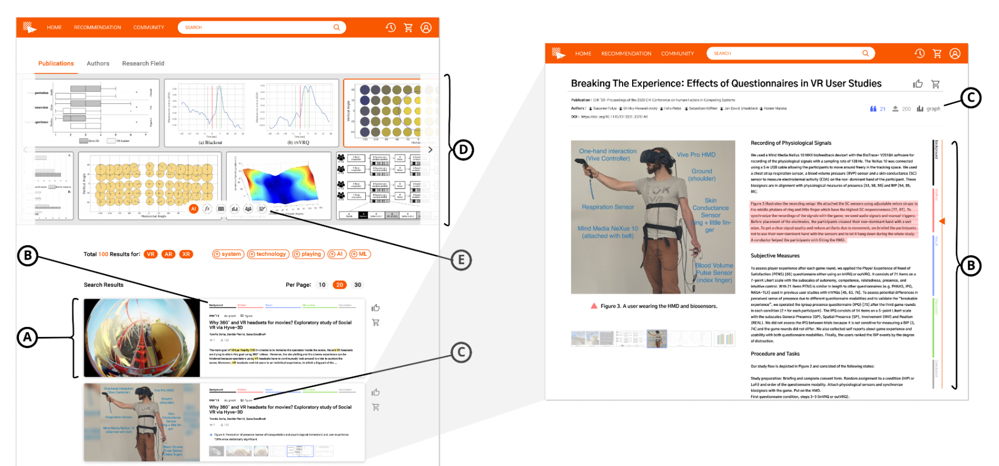

A class project from **KAIST ID503 Design Project** (Prof. Tak Yeon Lee), by Team 4F. I worked on
ideation and front-end development.

## Problem — finding the right paper is hard

Whether you're a novice or an expert, finding *the* paper is a slog. Search engines return only thin,
text-based metadata — title, authors, abstract — which rarely says enough to judge a paper at a
glance. And everyone sees the same summary, regardless of their purpose or interest. We wanted a
personalized way to summarize and visualize papers so researchers can quickly tell whether something
is worth their time.

## Solution — visual, personalized paper summaries

FigureOUT summarizes papers visually, in four ways:

- **Figure Cards** — search results as cards with thumbnails pulled from each paper.
- **Proportion Bar** — shows how much space each section takes, so you can guess a paper's structure
  without opening the PDF.
- **Content Icons** — label a paper by its number of graphs, images, and formulas.
- **Figure Wall** — gathers images from many papers into one frame to compare them and explore vague
  ideas.

Thumbnail extraction is personalized to each researcher's real-time search history and stated
interests, and a filter lets users switch between an AI-driven and a self-chosen visual summary.

## Value

By making relevance visible, FigureOUT saves the time researchers spend hunting and triaging papers —
time that can go back into the research itself.

