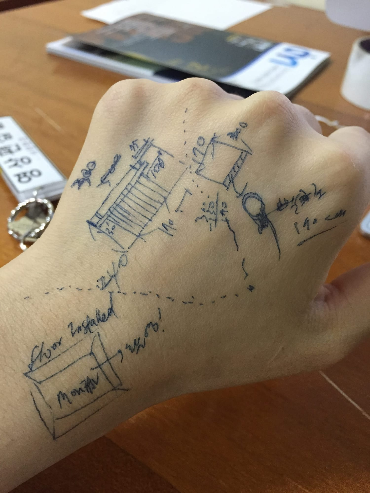
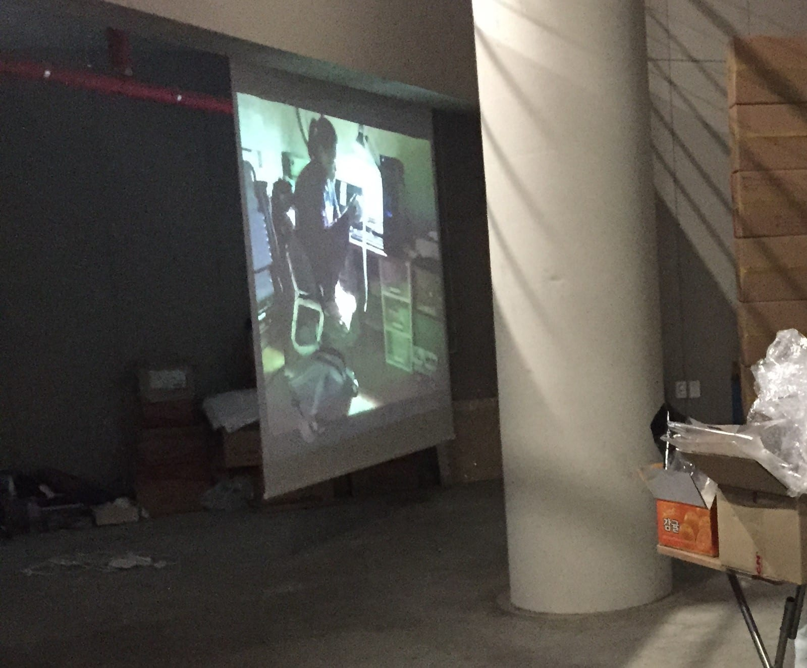
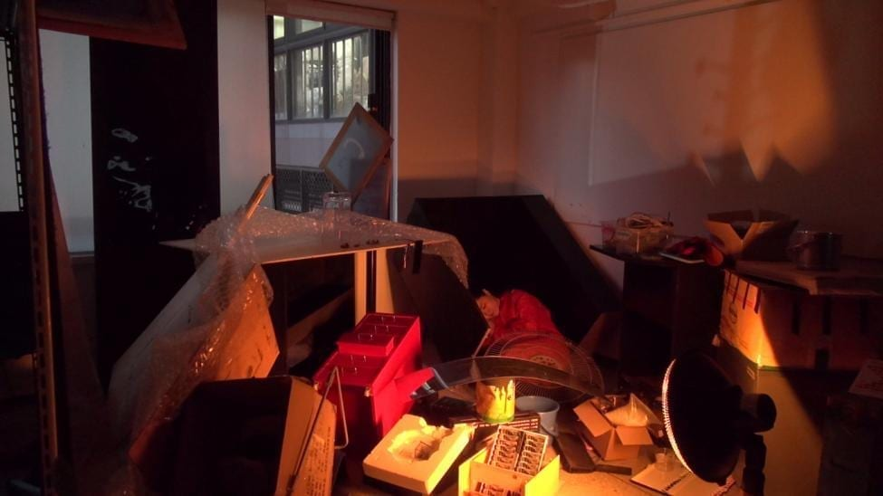

*Single-channel video · 7:59 · 2015*

*Human-furniture* was shown in **Dirt Luv**, my 2015 media art graduation exhibition. It came from a
blunt thought: that I had become a person with neither the will nor the vitality of a piece of
furniture — someone with even less function than the objects around them.

## A body that becomes furniture

In a single-channel video, a body slowly takes on the posture and stillness of the furniture it shares
the frame with — settling onto and around a chair until person and object are hard to tell apart. The
figure eats, slumps, and waits: dull, and seemingly without purpose.

