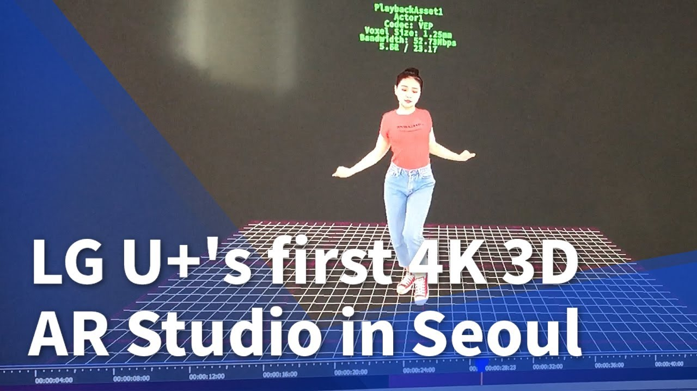

LG Uplus made a 4K 3D AR studio in Seoul to make killer 5G content. The studio uses 30 4K cameras to film entertainers such as K-Pop stars and yoga trainers from 360 degrees. For a 30-second video, rendering takes 3-4 hours. The final product is available through the smartphone to the customer of LG Uplus service. I was a member of the team led by Supervisor Sun-Gu Kim and participated as one of the camera operators and graphic designers in the project.

> Media coverage: UPI News

