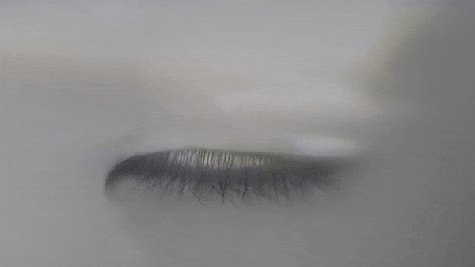
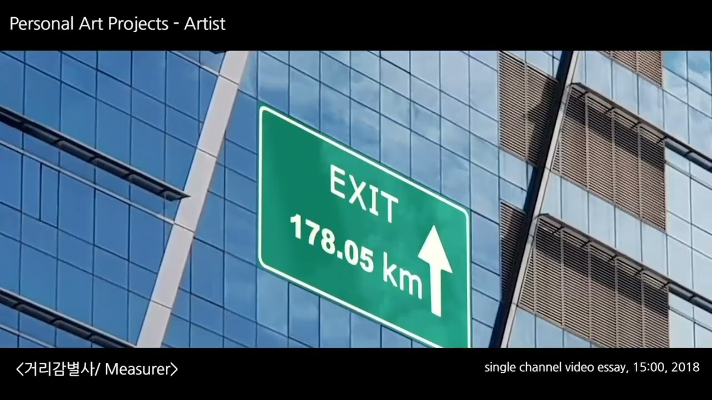

*Measurer* is my piece for **Lapses**, a digital race staged as an exhibition by the artist collective
Eobchae (funded by ZER01NE), in which four invited artists turned the screens of smart devices and a
web environment (LAPSES.KR) into a running track.

Across the race, the four runners — Sungsil Ryu, Hye-Young Jo, Iida Choi, and Minki Hong — each
produced a 10-second video every week, twelve times a week, from July 1 to September 16, 2018, while
Eobchae built and broadcast the track as a website. For the physical exhibition, the stadium format
was adapted to replay the web races in a gallery: from the thumbnails of all 48 clips (about 8 minutes
accumulated over 12 weeks), each runner's track was reconstructed and played in sequence on electronic
displays.

The video above and the images below are from *Measurer*, my entry in the race.

