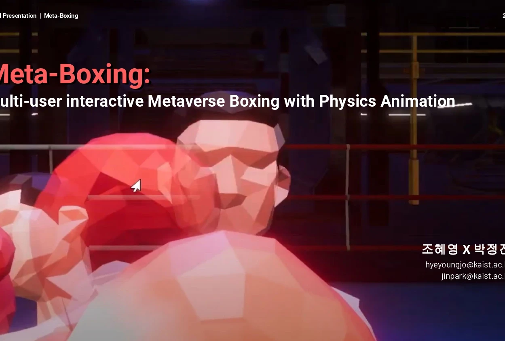
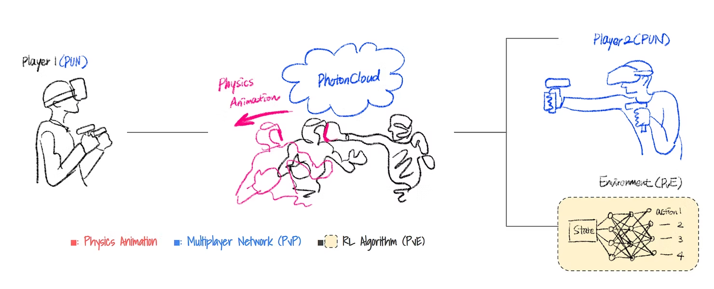
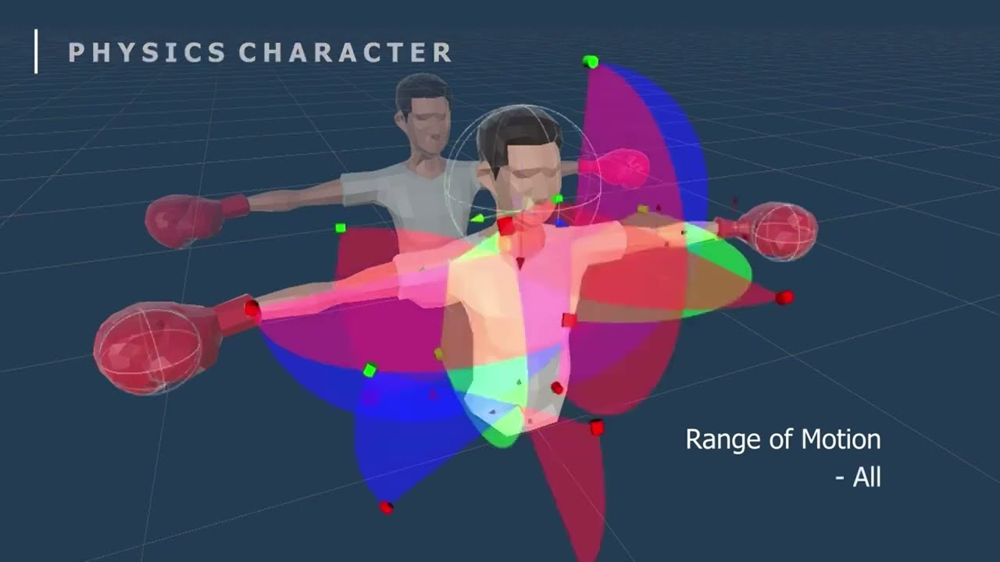

<Meta-Boxing> is a multi-player VR boxing game with controllable physics-based characters, a class project (KAIST GCT700 led by Prof. Woontack Woo. I participated in the study design, graphic design, and user study.

Statement Natural interaction is essential in VR boxing games where characters constantly collide. However, the characters of the existing VR boxing games are kinematic characters with either keyframe animation or ragdoll physics. Kinematic characters have unnatural interactions, such as playing the same reaction clip regardless of the strength and position of the attack and abrupt freeze after getting hit. We propose Meta-Boxing, a game where the player controls a physics- based character through a hidden kinematic character for various character reactions and natural transitions. Meta- Boxing characters can create dynamic movements cost-effectively without increasing simulator sickness when viewed from a third-person perspective.

Process

