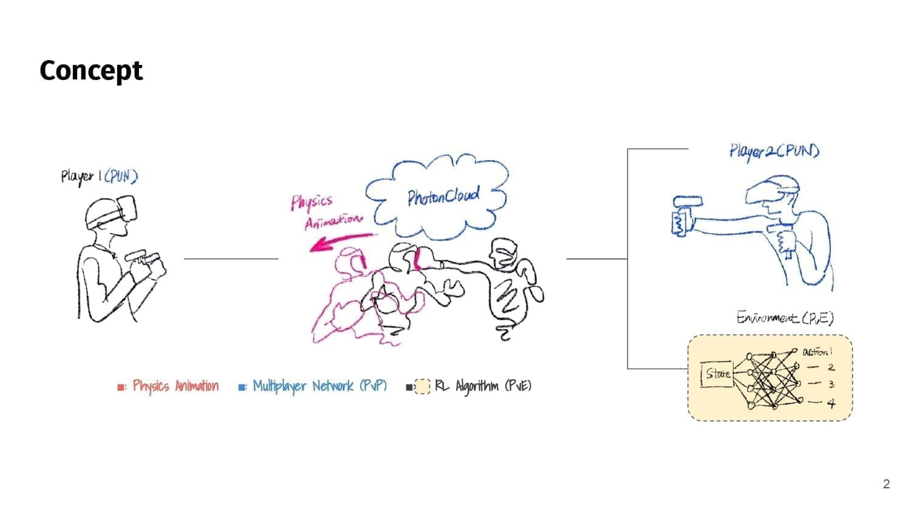
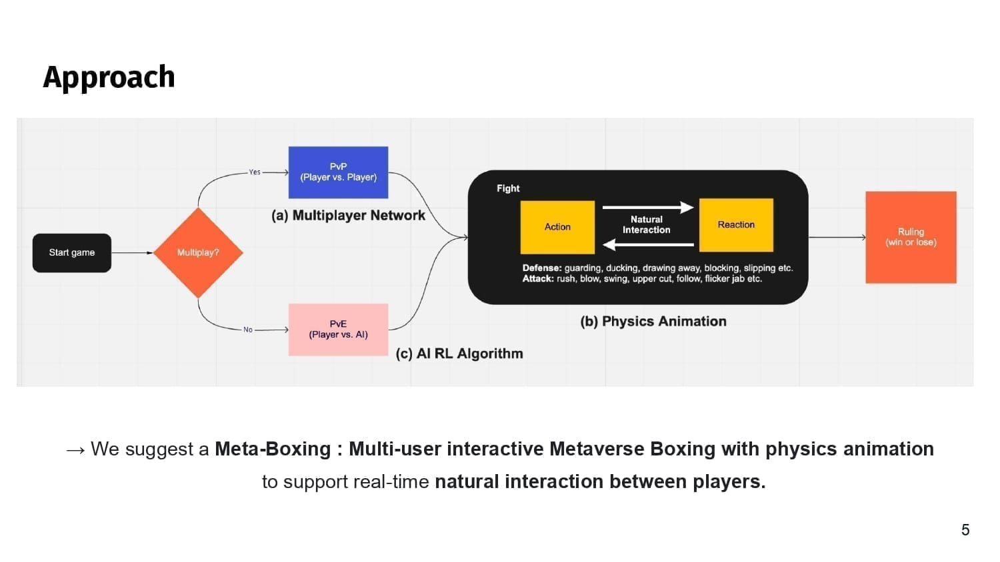
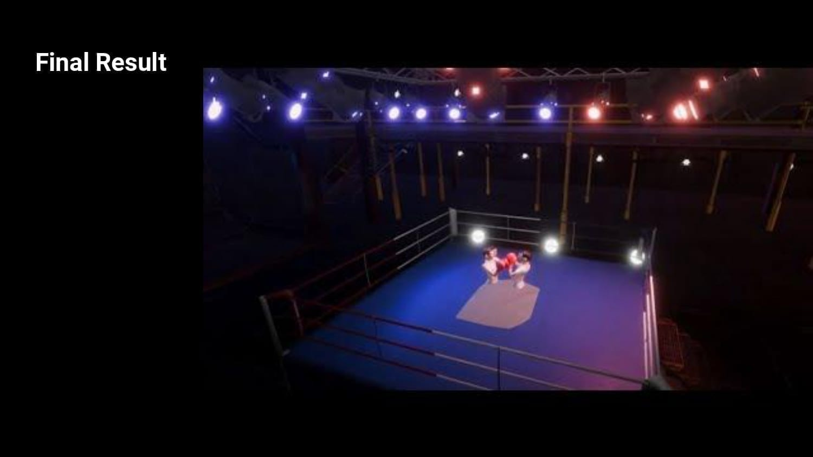
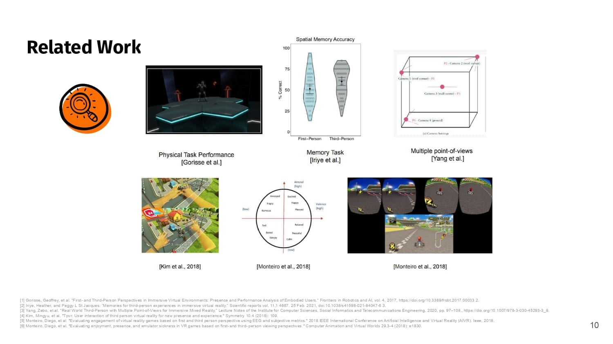
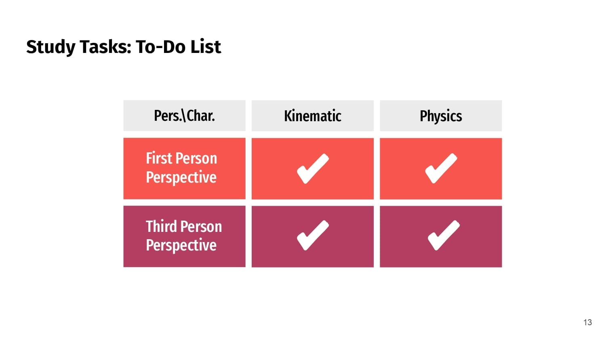
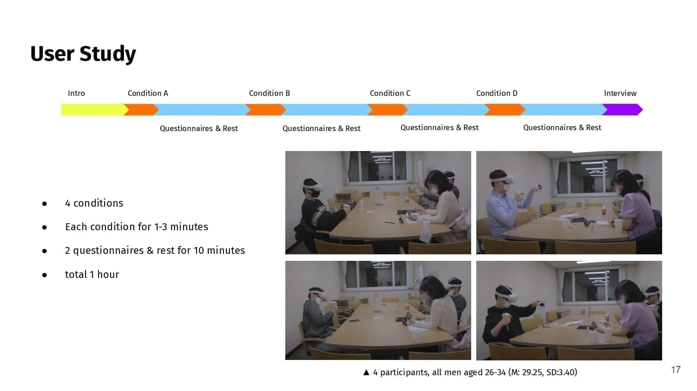
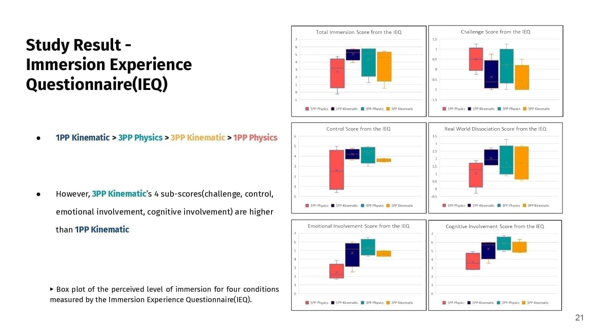
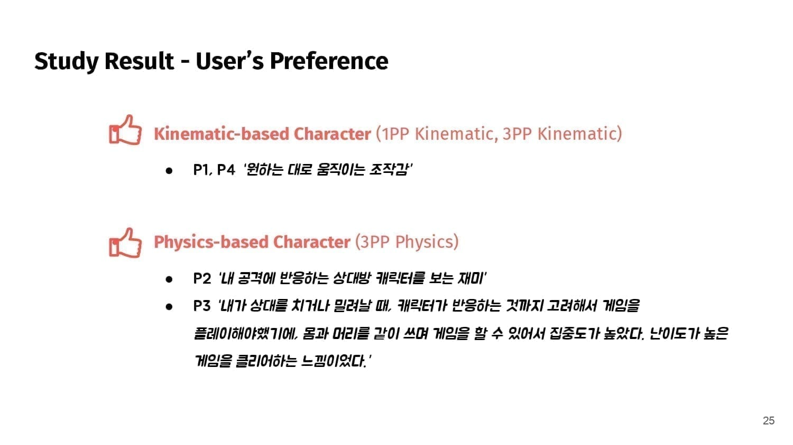

## Statement

Natural interaction is essential in VR boxing, where characters constantly collide. Existing VR
boxing games use kinematic characters (keyframe animation or ragdoll physics) that interact
unnaturally, replaying the same reaction regardless of an attack's strength or position, and
freezing abruptly after a hit. Meta-Boxing lets the player control a physics-based character
through a hidden kinematic character, enabling varied reactions and natural transitions. Its
characters create dynamic movement cost-effectively, without increasing simulator sickness when
viewed from a third-person perspective. (KAIST GCT700, led by Prof. Woontack Woo; I contributed to
study design, graphic design, and the user study.)

## Project deck

