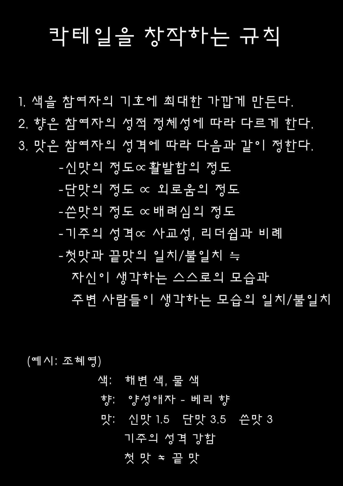
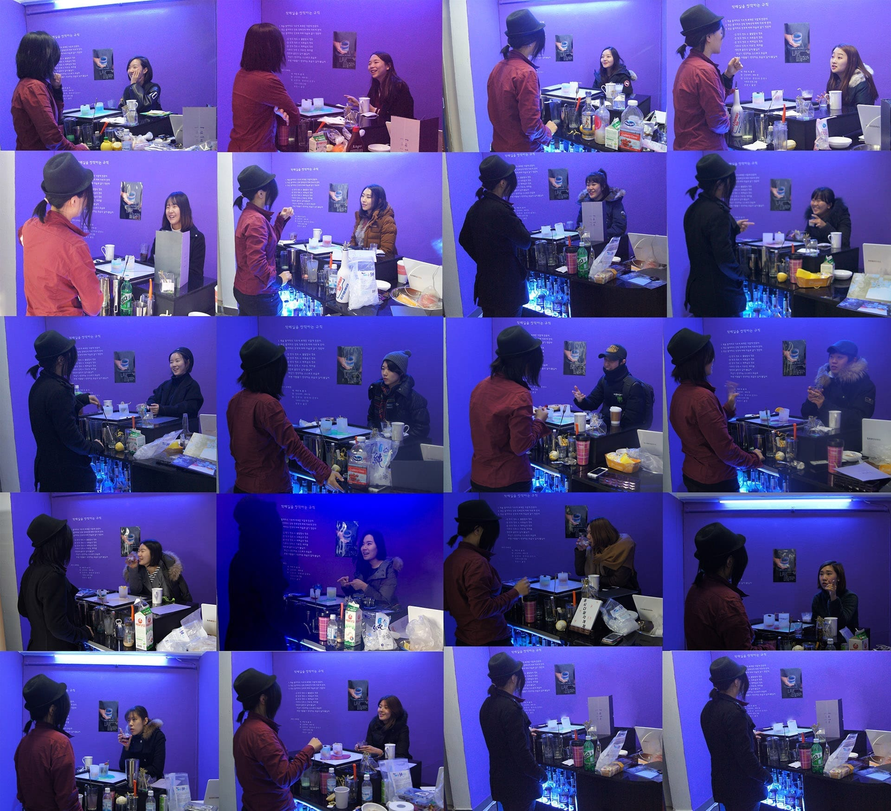
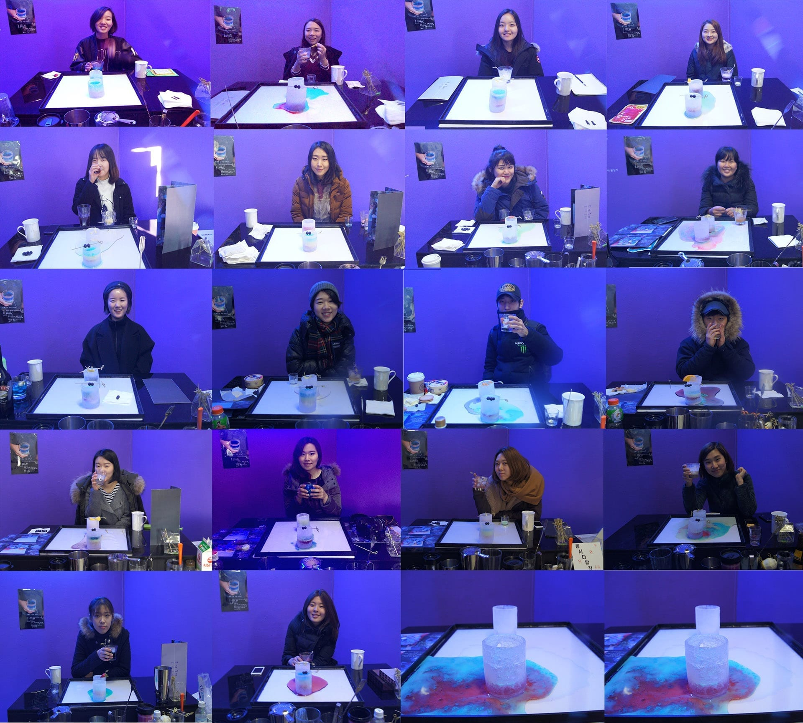
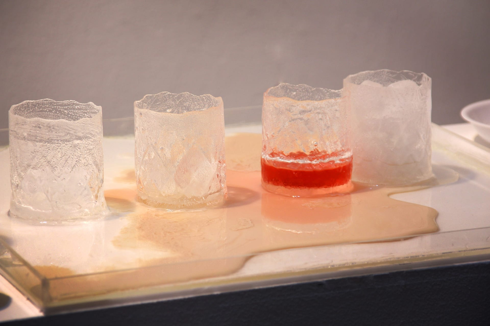
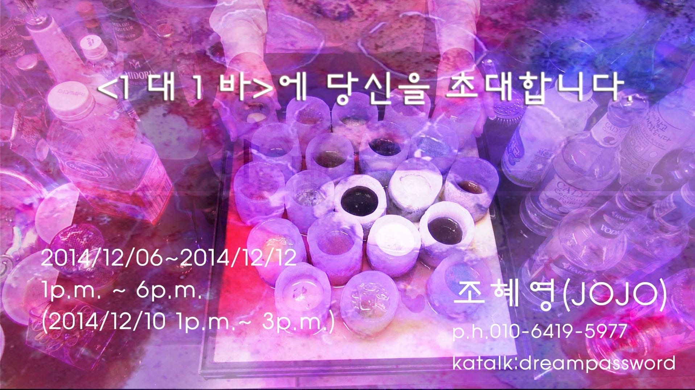

*Live performance with ice glasses and a single-channel video installation · 2014*

*1:1 Bar* is a bar for one guest at a time. I sit across from a single visitor, talk with them, and
mix them a cocktail that works as a portrait — their personality and identity translated into color,
scent, and taste.

## The recipe rules

Every drink follows a fixed set of rules, so the cocktail is *read* from the person rather than picked
from a menu:

- **Color** — kept as close as possible to the guest's own taste.
- **Scent** — set by their sexual identity.
- **Sourness** ∝ how lively they are.
- **Sweetness** ∝ how lonely they are.
- **Bitterness** ∝ how considerate they are of others.
- **Base liquor** — its character scaled to their sociability and leadership.
- **First taste vs. last taste** — matched or mismatched depending on whether how they see themselves
  lines up with how others see them.

## The bar

The drinks were served in glasses made of ice, with a single-channel video playing alongside the live
performance.

