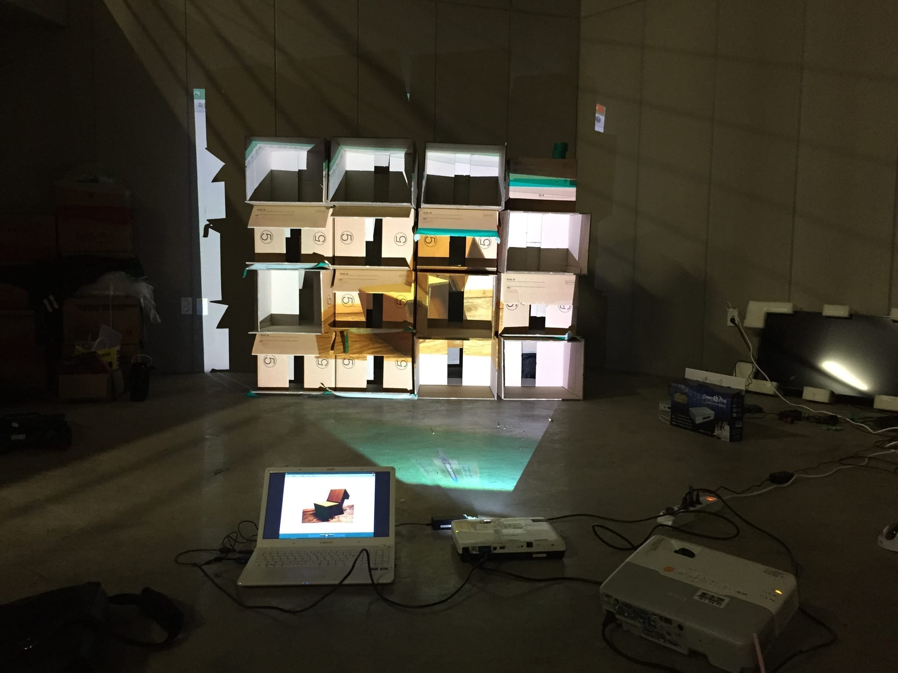
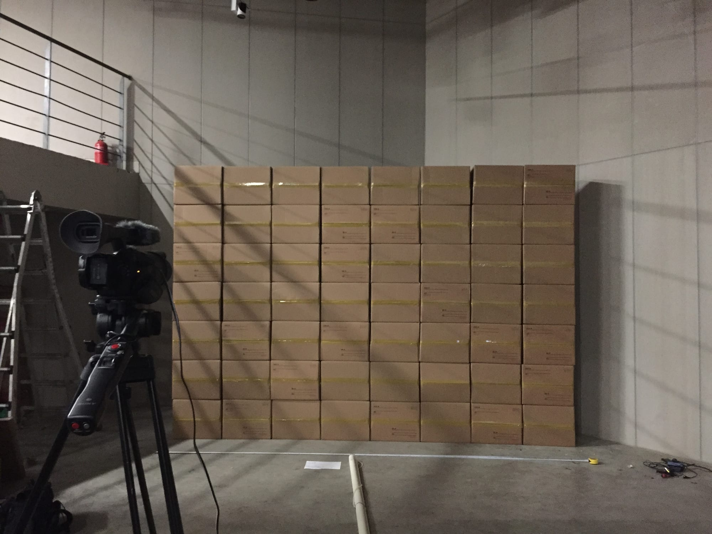
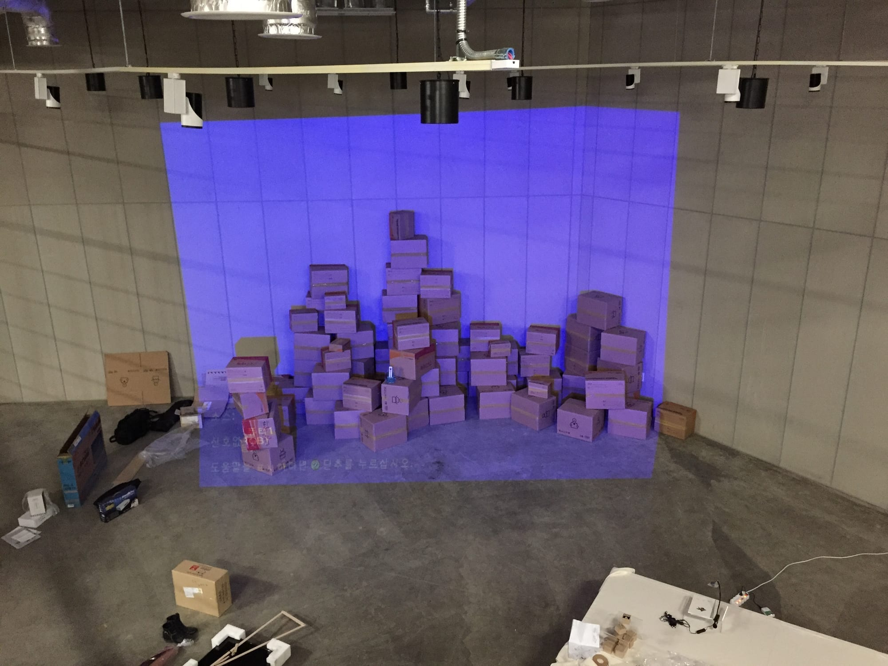

*Projection mapping on boxes · 1:19 · 2015*

*Package for Me* was shown in **Dirt Luv**, my 2015 media art graduation exhibition. The show grew
out of a feeling I couldn't shake. Against the cliché of youth "overflowing with passion," my
reality was closer to lethargy: a body that seemed to have less function than a piece of furniture,
worn down by days that repeat without change.

## A dismembered body and the magic box

When something hurts, physically or mentally, I feel an urge to cut off a part of my body: to pull
out my spine when my back aches, to drill a hole in my head when it throbs. I never act on it, but
strangely the cruel image itself loosens the pain for a moment. The destructive urge is born of a
greater pain, and imagining it gives a brief, real catharsis, a wish to escape the flesh.

These imaginings remind me of a magician's assistant placed in a box and run through with swords, the
box then pulled apart, even though magician and assistant are one and the same. The dismembered body
looks incapable of anything, yet in the act of imagining it apart, a kind of magic is handed to me.

