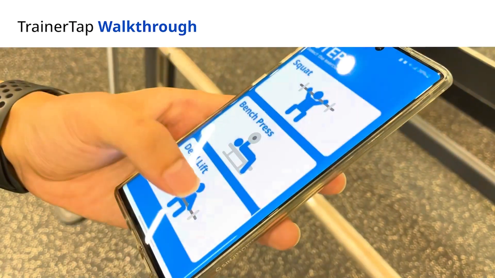
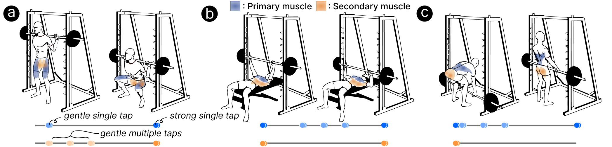

## Problem — solo workouts lack a trainer's quality

Working out alone at the gym rarely matches a session with a personal trainer, in both quality and
intensity. How can we close that gap for people exercising on their own?

## Solution — a wearable that replicates a trainer's touch and voice

A personal trainer taps your body to draw attention to the muscle you should be using, counts reps
aloud, and cheers you on to keep tension through the set. TrainerTap reproduces that tactile and
auditory guidance with three parts:

- a **Y-motion detector** on the bar (a Bluetooth-enabled Bluno Beetle Arduino, coin batteries, and a
  distance sensor) that senses the bar's vertical motion;
- **vibration devices** tucked into gym-clothing pockets (Bluno Beetle + battery + vibration motor)
  that mimic the trainer's tap;
- a **mobile app** that ties the devices together and delivers audio cues.

## Walkthrough

The user picks a target exercise in the app, attaches the detector and places the vibration devices,
then does three warm-up reps so the detector can calibrate their range of motion. From there it tracks
the lift and signals each vibration device, which buzzes in different patterns to cue *which* muscle to
use and *when* — while the app counts reps, guides breathing, and encourages.

## The big three lifts

The first prototype supports the big-three lifts, with four vibration devices giving feedback on
primary and secondary muscles. We designed the vibration patterns together with three experienced
trainers.

