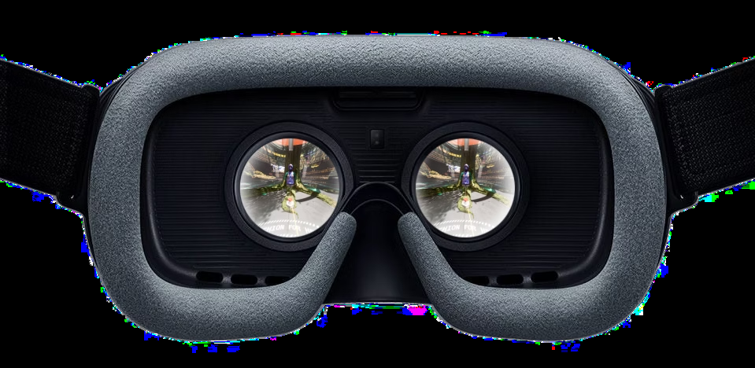
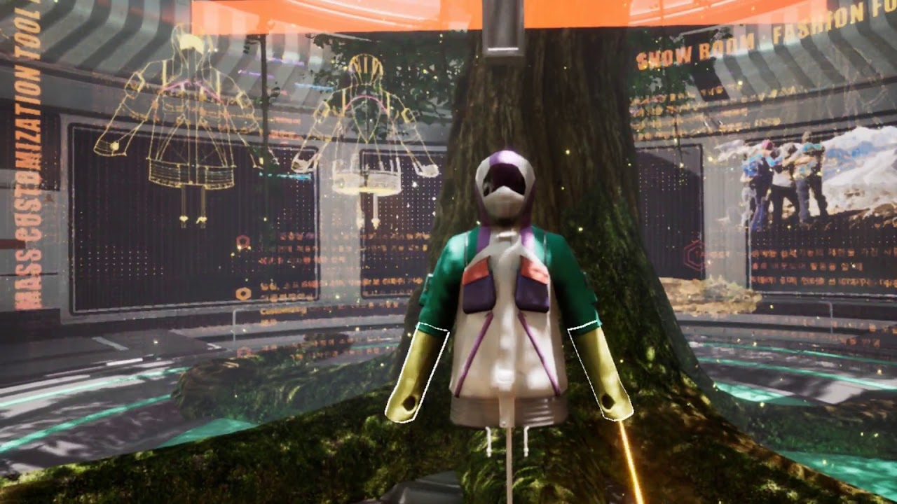
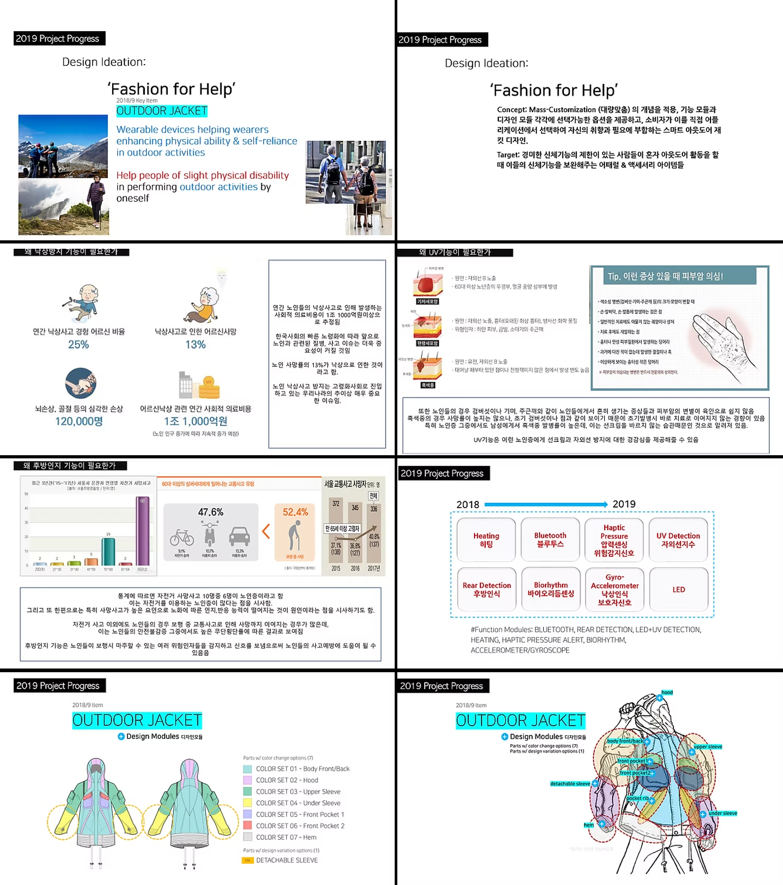
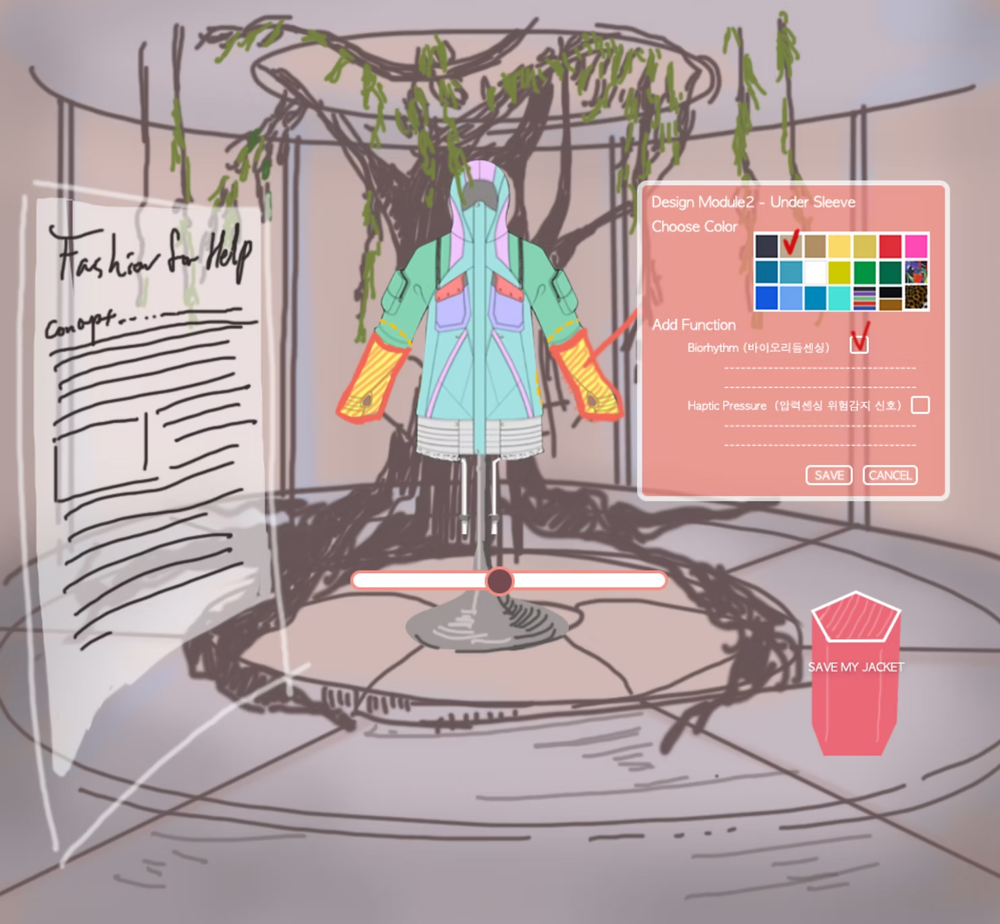

Kookmin University

Mountain climbing is one of the most popular hobbies in South Korea, especially among people over 40 years old. Unfortunately, with the popularity of climbing, the frequency of falls is also increasing.

The Kookmin university designed a smart outdoor jacket and planned a business strategy of 'mass customization' to manufacture the jacket customized per the needs of individual users(e.g., personal preference in design and medical condition due to aging such as decreased eyesight, decreased physical ability, changes in posture, changes in blood pressure, increased risk of skin cancer, decreased memory).

Process

Concept designed by Kookmin university research team

Function Modules

Concept Sketch for VR Show Room

VR development process

Final Scene

VR Show Room Demo

Choose The Function and Color of The Jacket

Simulate The Design

