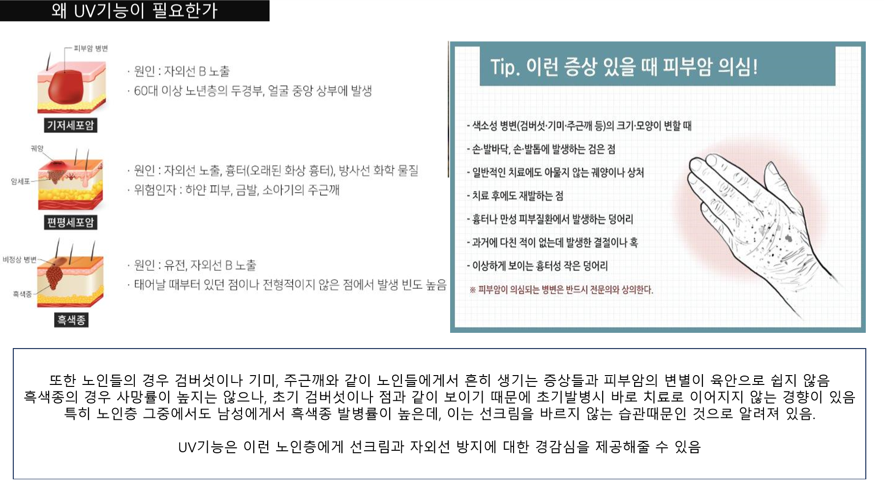
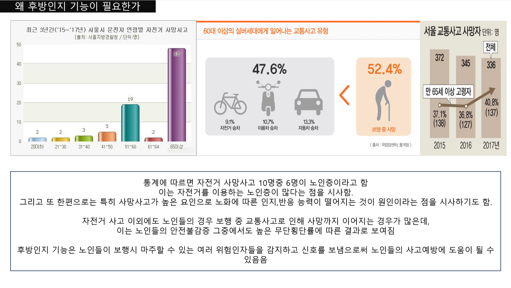
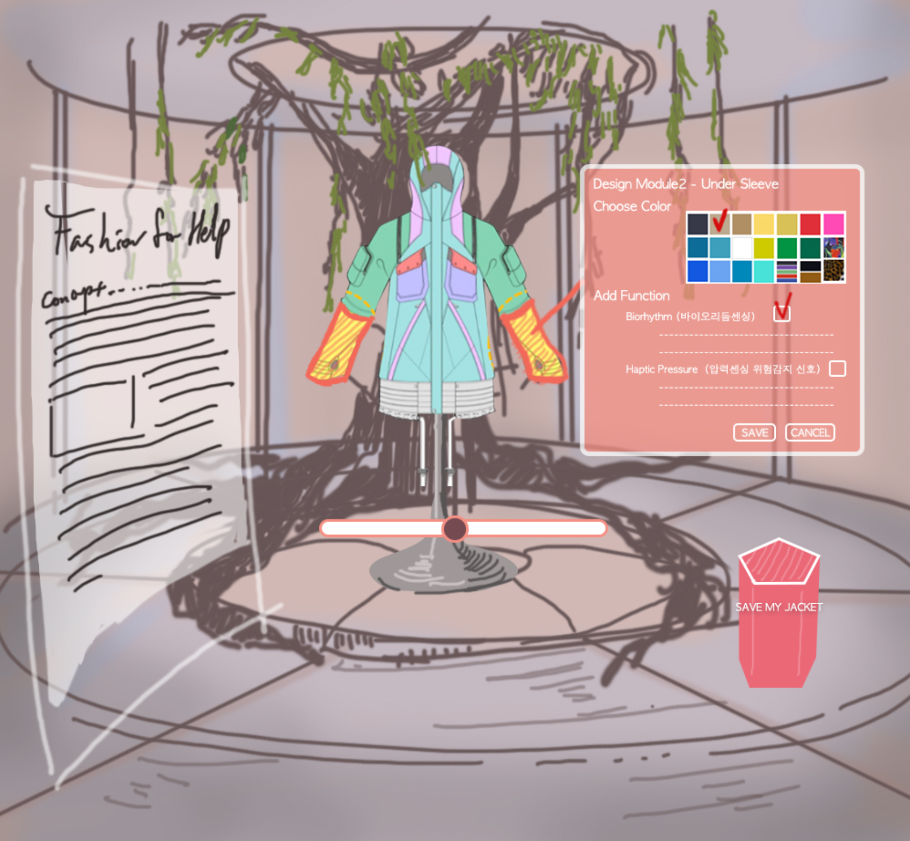
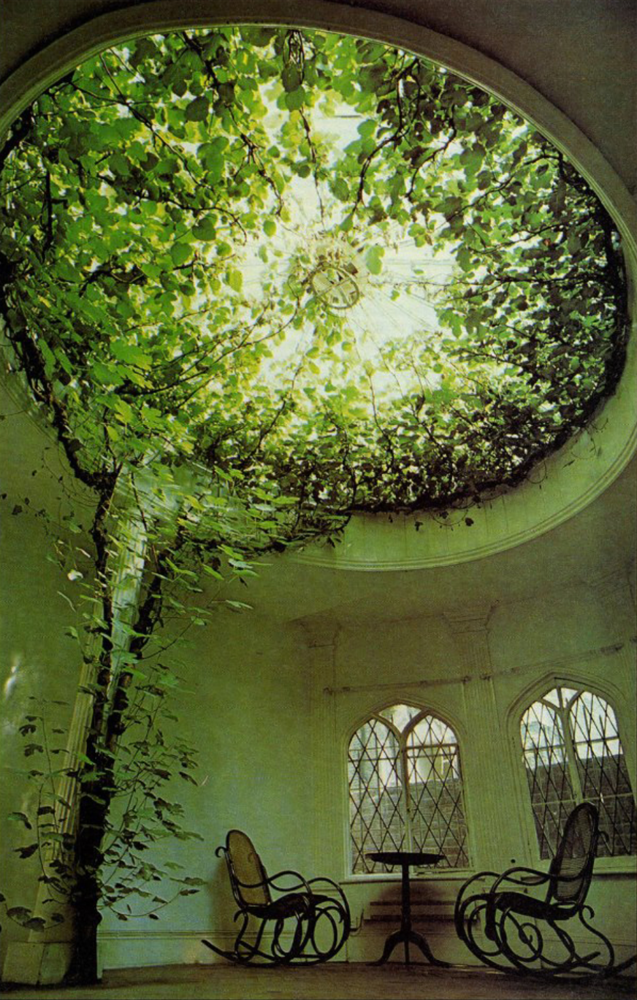
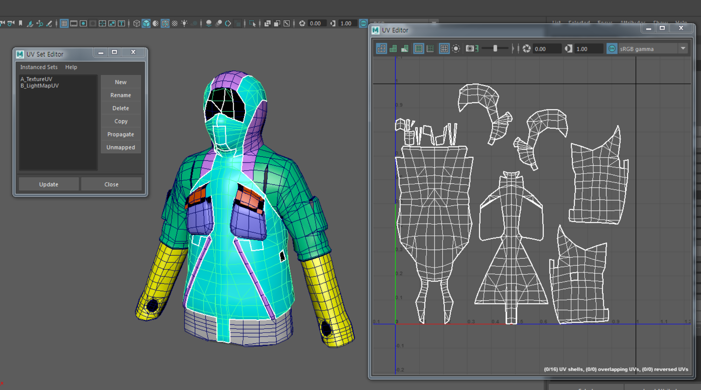
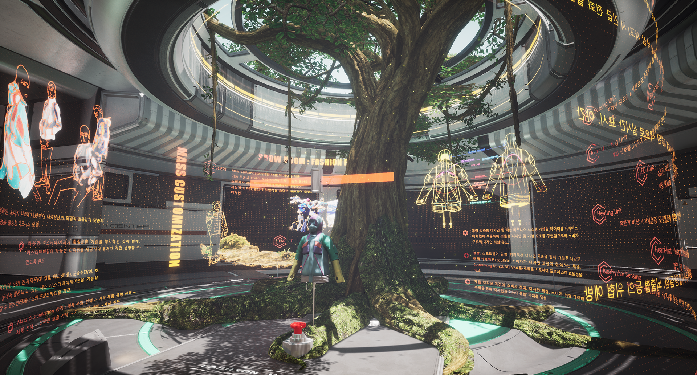
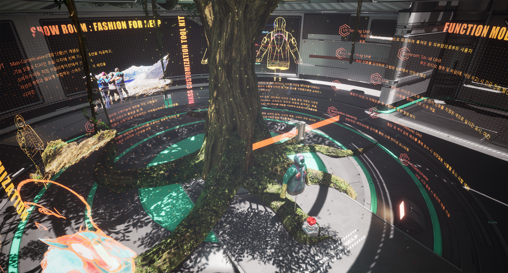
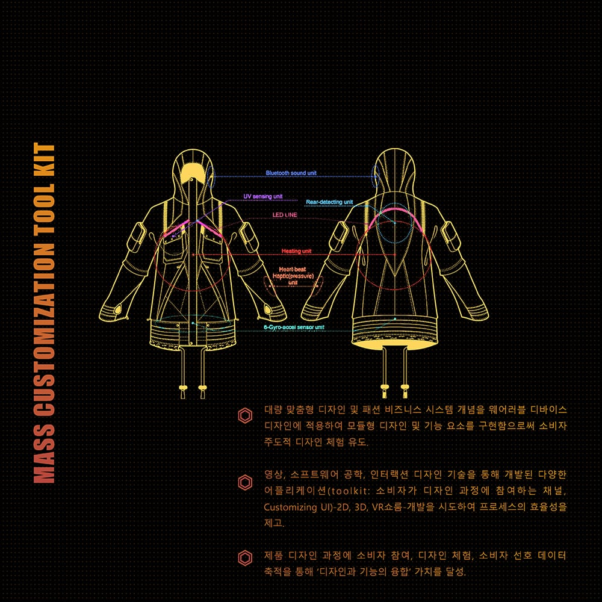
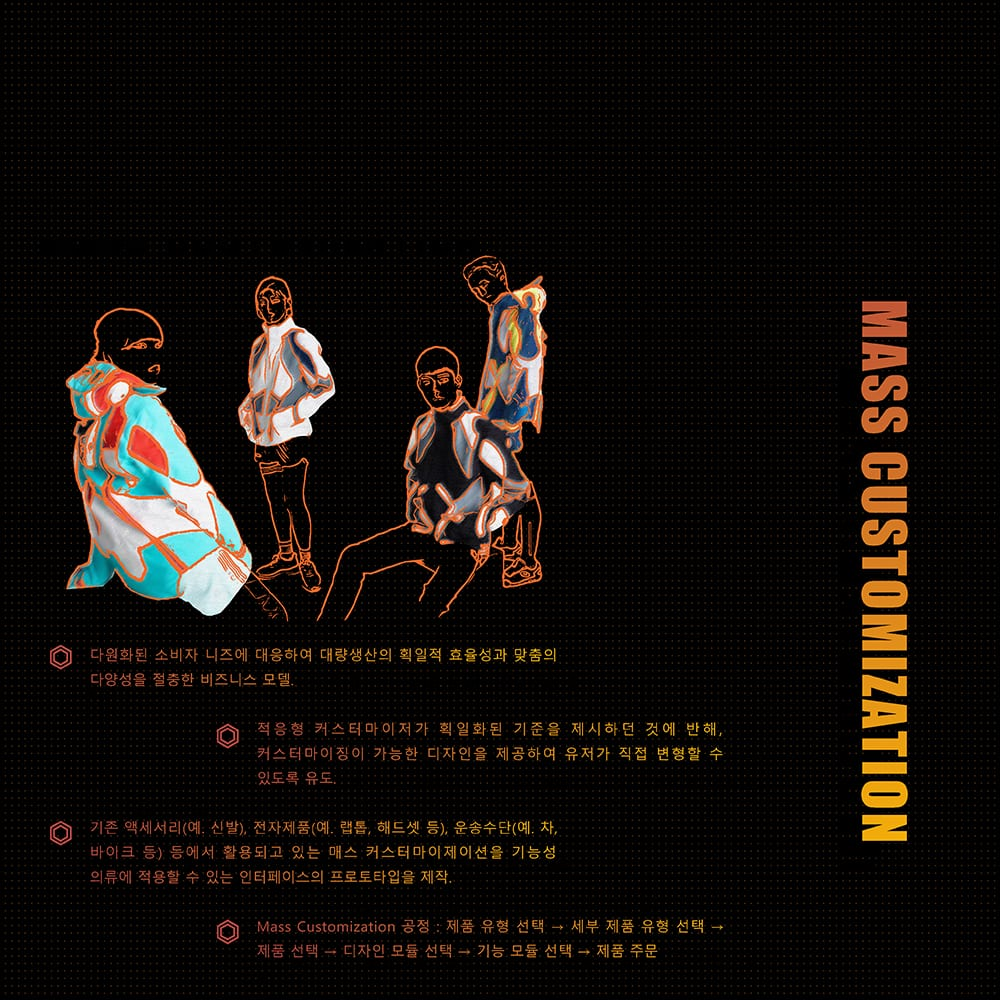
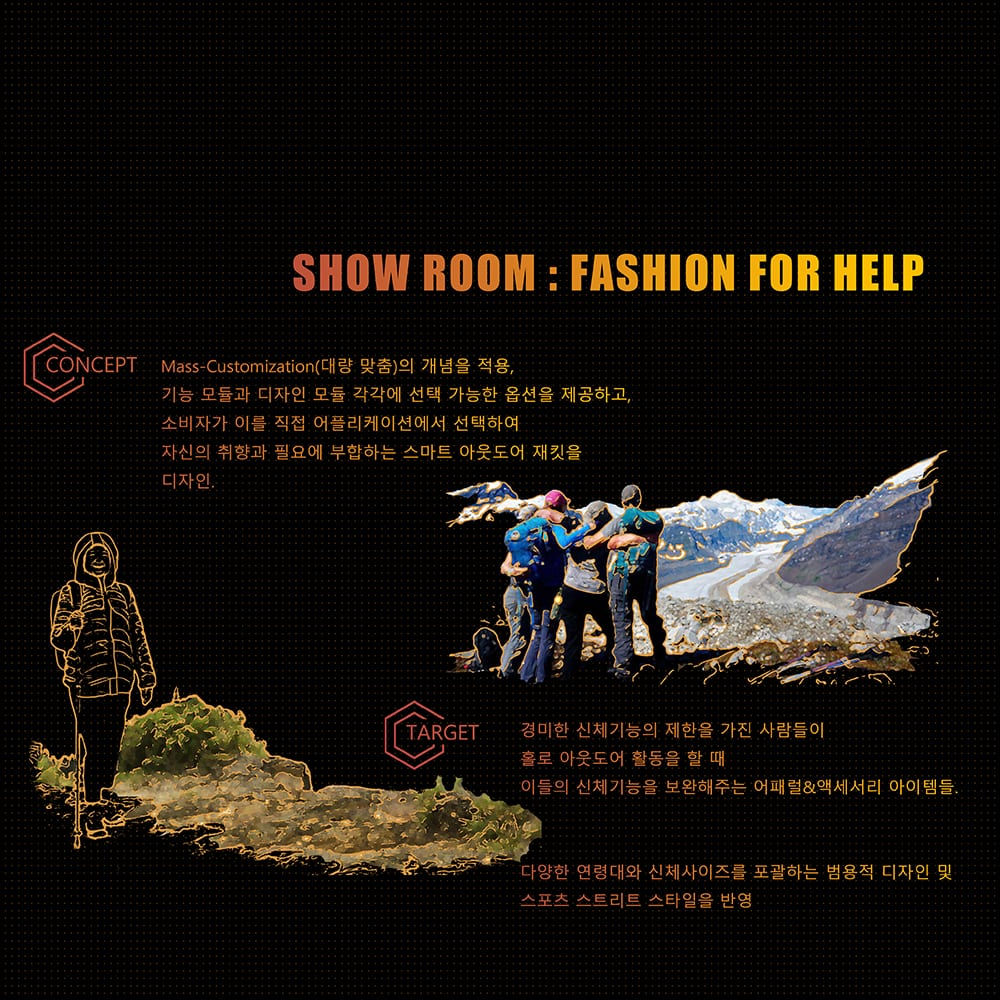

VR Fashion for Help is a VR show room for smart outdoor jackets designed by Prof. Young Mo Son at
Kookmin University. As a freelance developer (lead) and VR generalist, I designed and developed
the VR show room.

Mountain climbing is one of the most popular hobbies in South Korea, especially among people over
40. As climbing has grown, so has the frequency of falls. Kookmin University designed a smart
outdoor jacket and a "mass customization" strategy — jackets tailored to each user's needs, from
design preferences to aging-related conditions (decreased eyesight and physical ability, posture
and blood-pressure changes, higher skin-cancer risk, reduced memory).

## Concept

## Function modules

## VR show room

