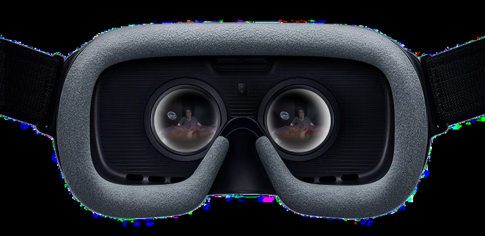
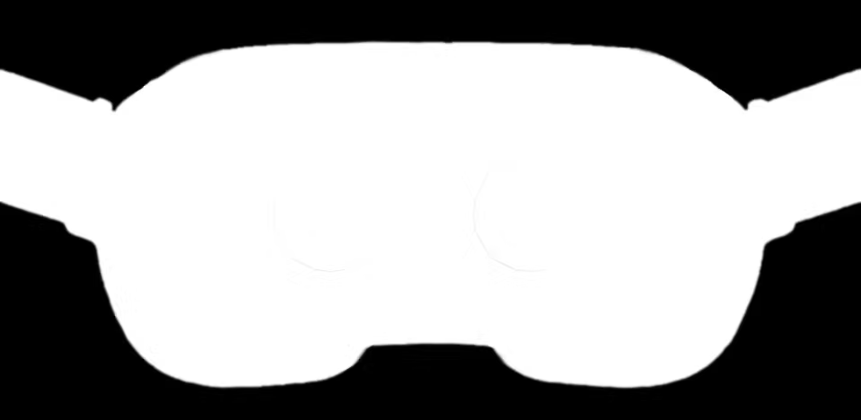
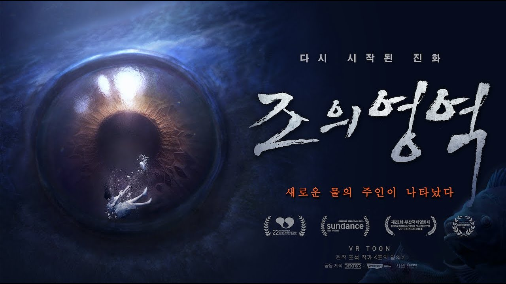
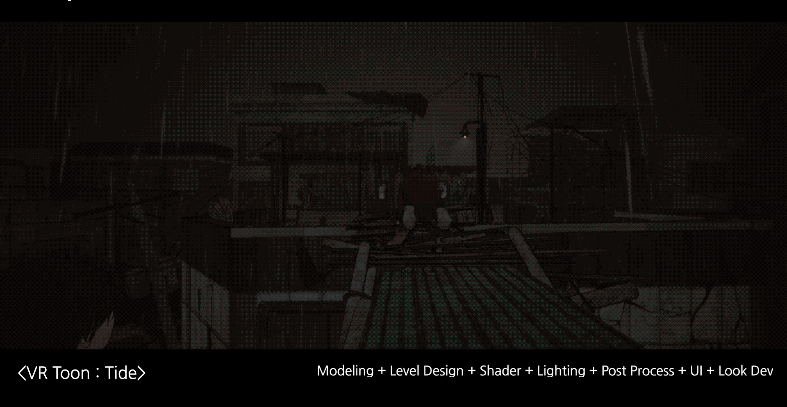
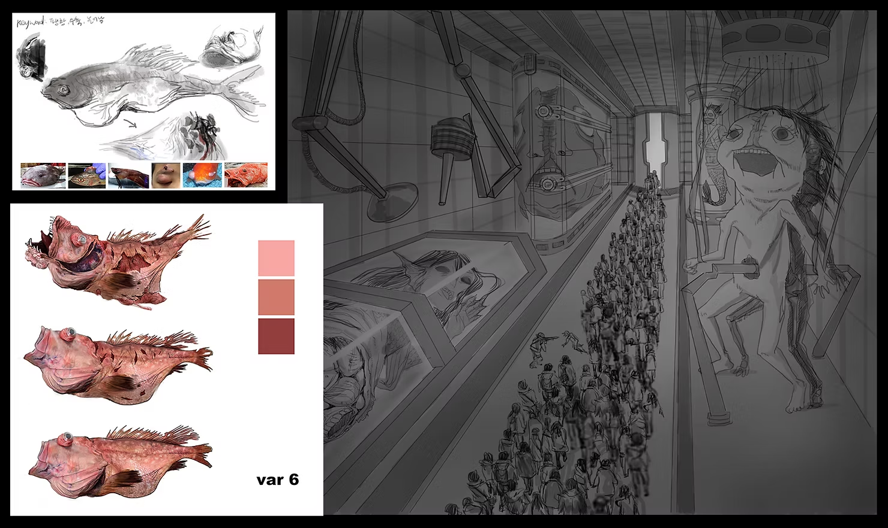
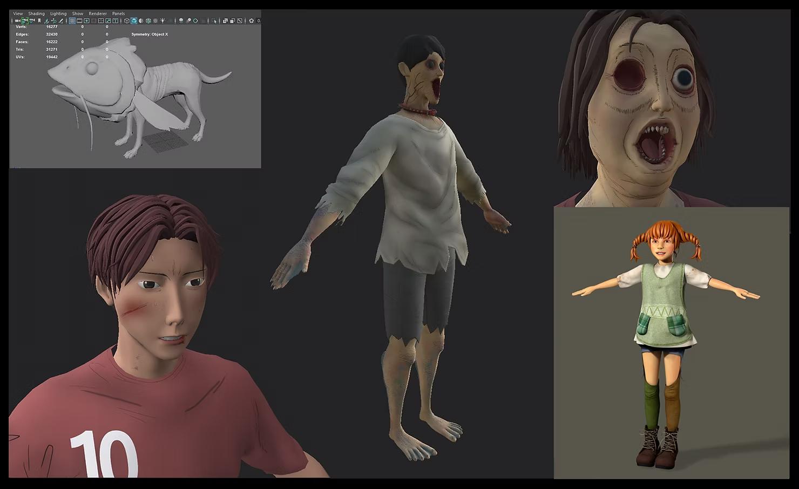

<VR The Tide> is a VR Toon Film made by Dexter Studios based on the original Naver webtoon <The Tide> (written/pictured by Seok Jo) in VR. The director Tae-Kyung Yoo produced a total of 6 short, interactive horror films, each with a running time of about 5 minutes.

Storyline Humanity is suffering from the worst drought in history. Humans are no longer masters of water. Giant fishes, much larger than humans, devour people and ravage cities. After the fish attack, humans turn into fish zombies.

The main character, So-Won Moon, is a 17-year-old high school student with a physical disability. He tricks his auntie(zombie) next door into thinking he is her dead son and tries to survive.

Visual Style and Interaction Design To avoid Uncanny Valley, which is the unpleasant feeling of seeing human-like digital characters, we keep the cartoon- like feel as it is. Also, we fix the camera's position and allow the user only to rotate it to minimize VR motion sickness.

Process I participated as a VR Artist in the production of episodes 2 to 6 and was in charge of concept art, modeling, level design, lighting, look development, and UI.

Concept Art

3D Modeling

3D Texturing

Level Design

Level Optimization

Lighting

Material

Effect

Look Development

Animated UI

