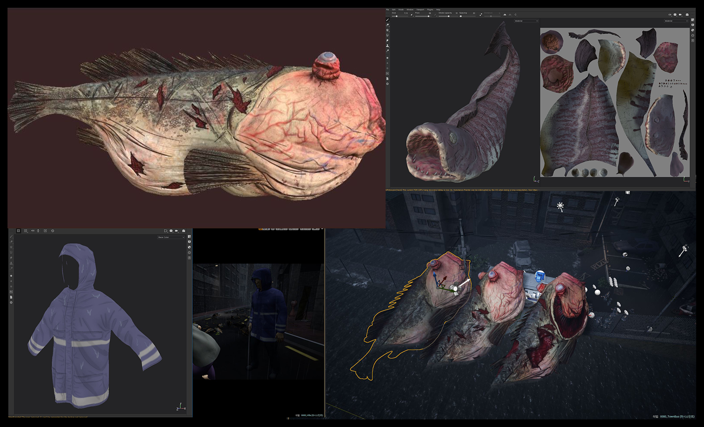
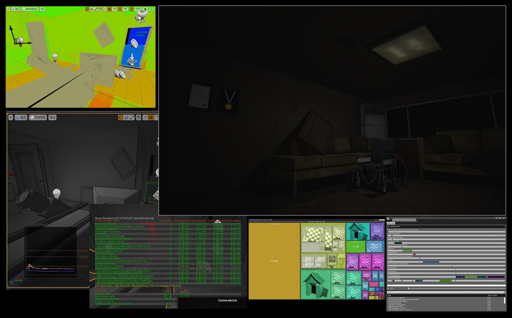
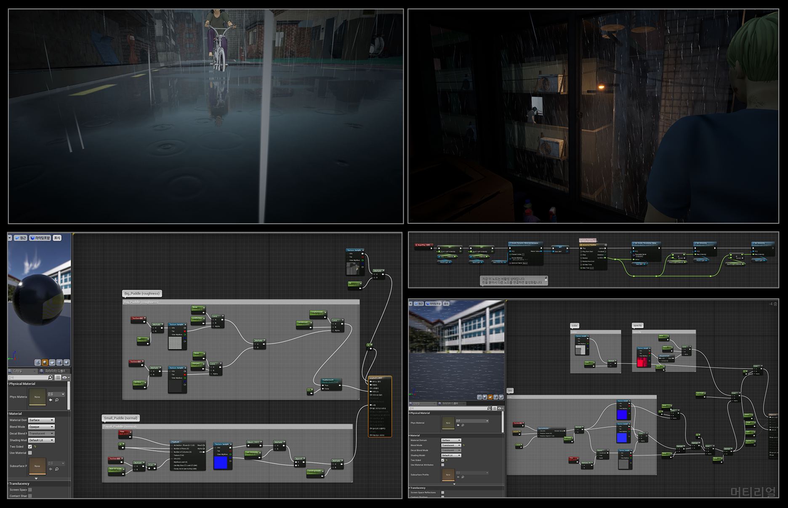
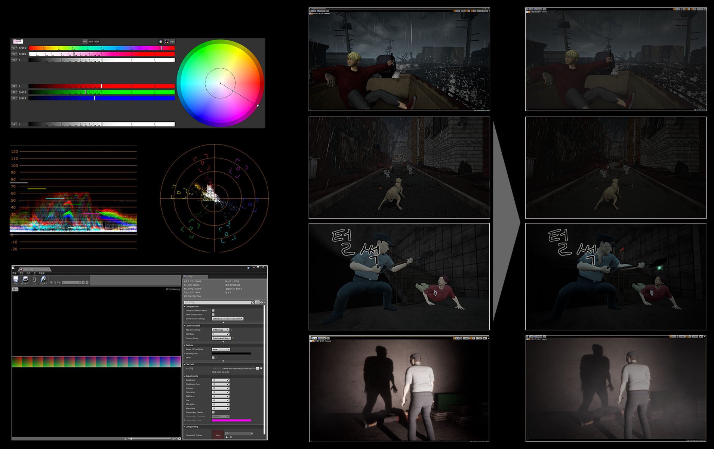
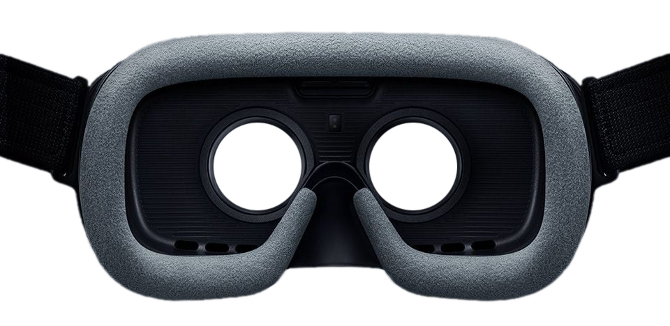

VR The Tide is a VR toon film made by Dexter Studios based on the original Naver webtoon
*The Tide* (written and illustrated by Seok Jo). Director Tae-Kyung Yoo produced six short,
interactive horror films, each running about five minutes.

## Storyline

Humanity is suffering the worst drought in history; humans are no longer masters of water. Giant
fish, far larger than people, devour humans and ravage cities, and those caught turn into fish
zombies. So-Won Moon, a 17-year-old high-school student with a physical disability, survives by
tricking his zombified aunt next door into believing he is her dead son.

## Visual style & interaction

To avoid the uncanny valley (the unease of seeing human-like digital characters), we kept the
cartoon-like feel intact. We also fixed the camera position and let the user only rotate the view,
minimizing VR motion sickness.

## Process

I joined as a VR artist on episodes 2-6, working across the art pipeline: concept and modeling,
texturing and look development, lighting, materials and effects, level optimization, and animated UI.

