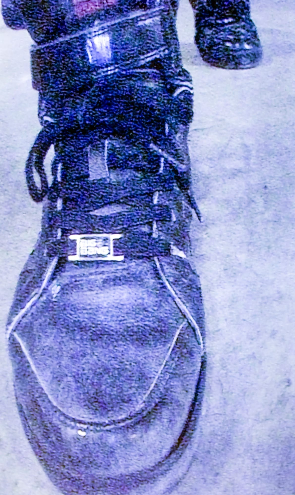
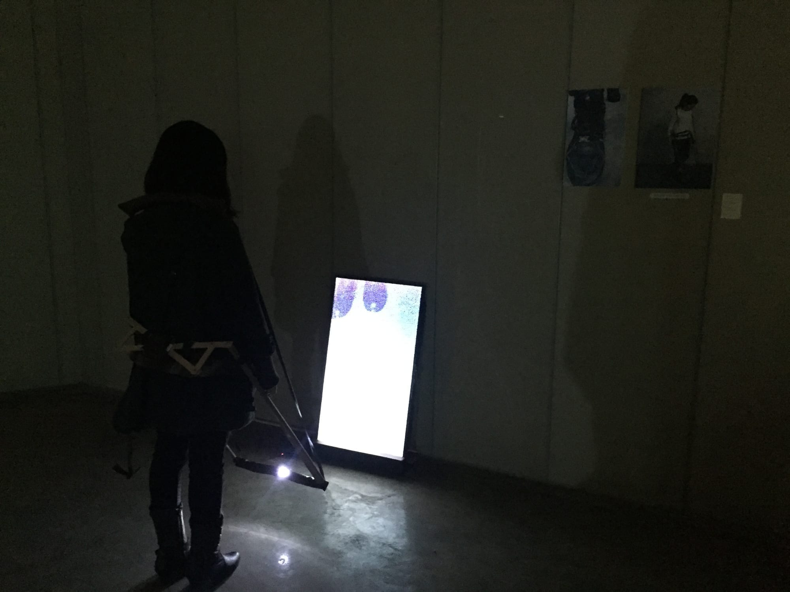

*Interactive media · 2015*

*Walking on the Spot* was part of **Dirt Luv**, my 2015 media art graduation exhibition, where I kept
returning to the feeling of endlessly walking in place — walking and walking yet staying exactly where
I started.

## A device for going nowhere

I built a wearable harness: leather straps run from a waist belt down to the feet, so that lifting one
foot pulls the other back. The wearer can keep walking, but only in place. The body performs the full
motion of moving forward while the ground never changes — exhaustion without distance.

## Making

